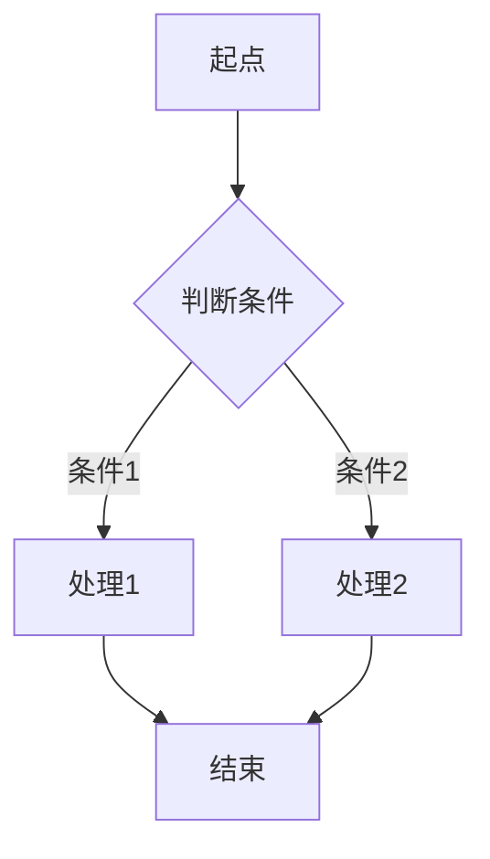
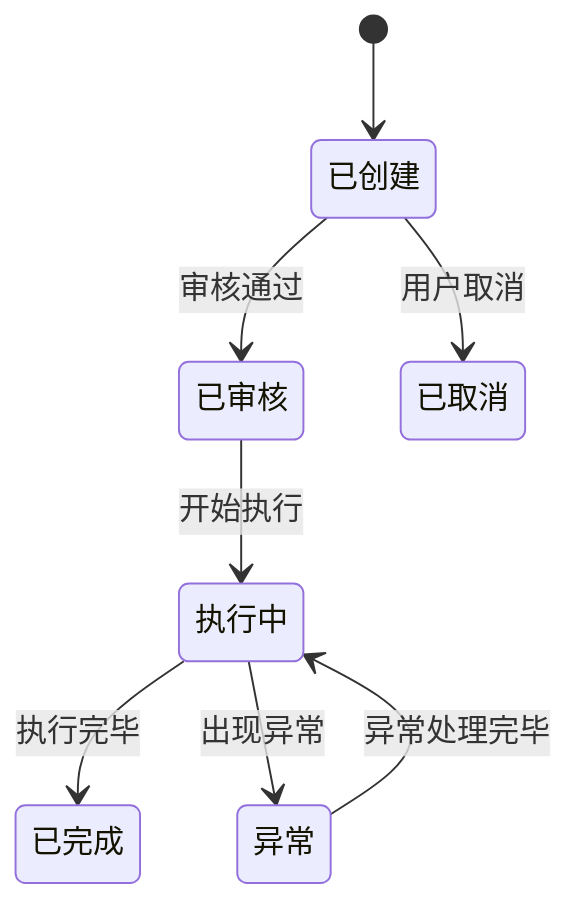

# {DOMAIN_CODE} {领域中文名}

## 1. 业务概述

{一段话概述本领域的定位、边界、核心职责}

**上游**：{数据/指令从哪里来}
**下游**：{数据/指令往哪里去}
**核心价值**：{这个模块解决什么业务问题}

## 2. 核心流程

### 2.1 {主流程名称}

{文字描述}

### 2.2 {分支/异常流程名称}

{文字描述}

## 3. 业务规则

### 3.1 {规则类别}

| 规则编号 | 规则名称 | 触发条件 | 处理逻辑 | 优先级 | 备注 |
|---------|---------|---------|---------|--------|------|
| R-{DOM}-001 | | | | | |

### 3.2 状态流转

## 4. 数据实体

### 4.1 {主实体名称}

| 字段名 | 中文名 | 类型 | 必填 | 说明 | 来源/维护方 |
|--------|-------|------|------|------|------------|
| | | | | | |

### 4.2 关键枚举值

| 枚举名 | 值 | 说明 |
|--------|-----|------|
| | | |

## 5. 系统交互

### 5.1 接口清单

| 接口方向 | 对端系统 | 接口名称 | 触发时机 | 同步方式 | 关键字段 |
|---------|---------|---------|---------|---------|---------|
| 入 | | | | | |
| 出 | | | | | |

### 5.2 数据流向图

## 6. 角色与权限

| 角色 | 核心操作 | 审批权限 | 数据可见范围 |
|------|---------|---------|------------|
| | | | |

## 7. 已知问题与历史决策

> **{问题/决策标题}** ({日期})
> 背景：...
> 决策：...
> 影响：...
> 当前状态：仍在使用 / 已废弃 / 计划替换

## 8. 待确认事项

- [ ] {待确认问题1}
- [ ] {待确认问题2}
