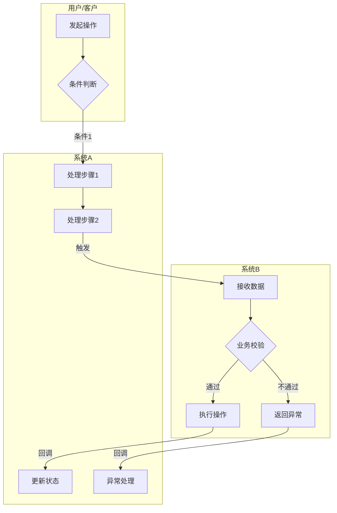
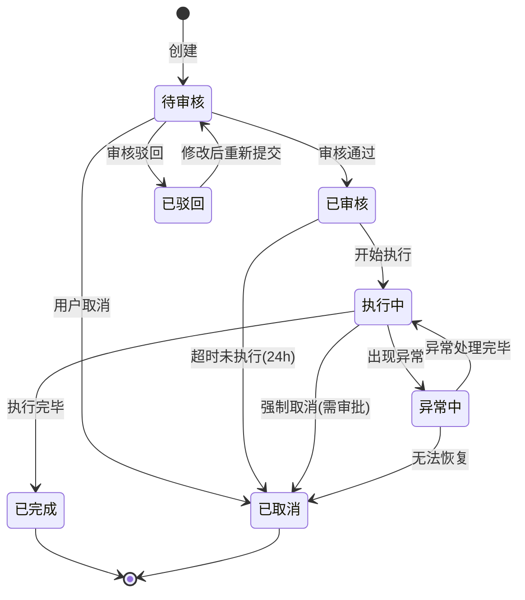
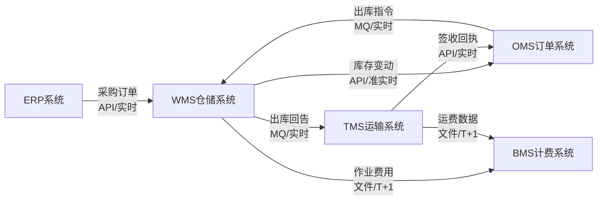
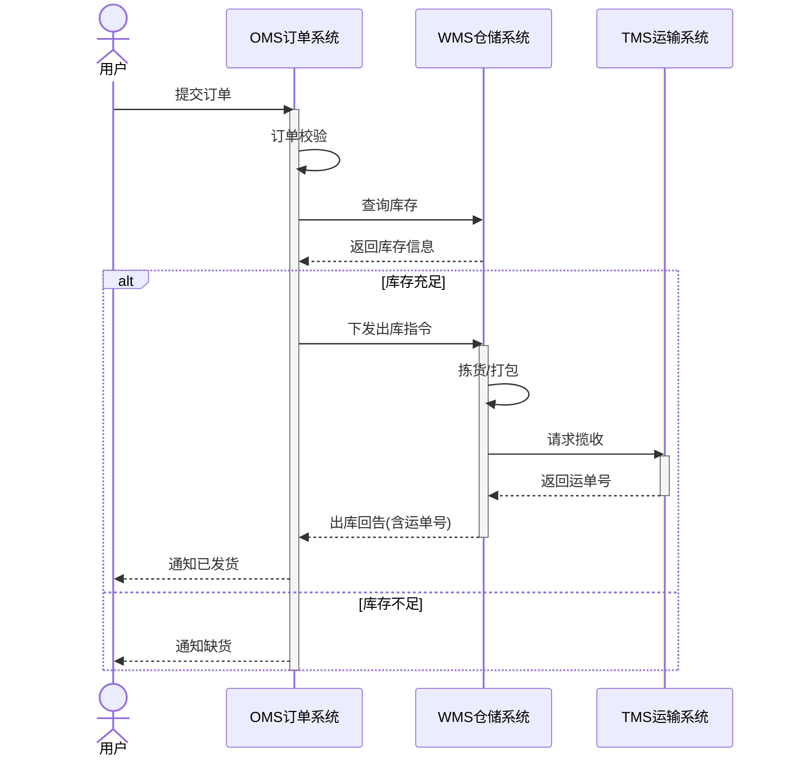
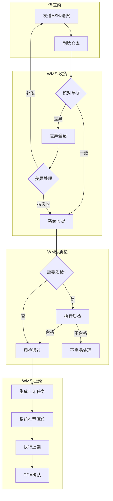
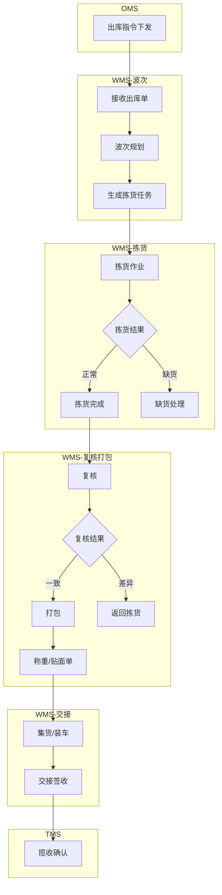

# 流程图绘制规范与模式库

## 绘制工具

根据图表复杂度和类型选择合适的格式：

**Mermaid**（状态图、时序图、数据流、简单流程）：
- 纯文本，可版本管理
- Claude Code和Claude.ai都能渲染
- 可嵌入Markdown文档
- 适合 ≤12 节点的流程图

**YAML DSL → draw.io**（泳道图、复杂流程）：
- 真正的泳道容器，精确布局
- 解决 Mermaid subgraph 无法精确控制节点位置的问题
- 通过 `yaml2drawio.py` 脚本转换为 `.drawio` 文件
- 详细 YAML 规范见 `references/diagram-yaml-schema.md`

## 图表类型选择

| 场景 | 图表类型 | 推荐格式 | 语法/工具 | 判断规则 |
|------|---------|---------|-----------|---------|
| 跨角色/跨系统的业务流程 | 泳道图 | **YAML → draw.io** | `.diagram.yaml` + `yaml2drawio.py` | 涉及 ≥2 个角色/系统的协作流程 |
| 复杂流程（>12节点+交叉连线） | 流程图 | **YAML → draw.io** | `.diagram.yaml` + `yaml2drawio.py` | 节点数 >12 或存在跨泳道交叉连线 |
| 简单泳道（≤3泳道+≤12节点） | 泳道图 | Mermaid（可选） | `graph TD` + subgraph | 泳道少且节点少时可用 Mermaid 简化 |
| 实体状态变化 | 状态机图 | Mermaid | `stateDiagram-v2` | 所有状态流转场景 |
| 系统间数据流 | 数据流图 | Mermaid | `graph LR` | 系统间数据传递关系 |
| 复杂时序交互 | 时序图 | Mermaid | `sequenceDiagram` | 系统间调用时序 |
| 系统架构概览 | 架构图 | Mermaid | `graph TD` + subgraph | 低复杂度架构展示 |
| 简单流程（≤12节点） | 流程图 | Mermaid | `graph TD` | 节点数 ≤12 且无复杂交叉 |

## 泳道图布局约定

所有泳道图遵循以下布局规则：

- **泳道横向排列**：每条泳道是一个竖直的列，从左到右排列
- **流程从上往下**：节点在泳道列内纵向排列，跨泳道连线在列之间横向连接
- **泳道之间有清晰分隔**：每条泳道列有独立边框，相邻泳道边框形成自然的分隔线
- `lanes` 列表的定义顺序 = 从左到右的列顺序

## 模式 1: 业务泳道图

用于表达跨角色、跨系统的协作流程。

### 推荐方案：YAML → draw.io

当泳道 ≥2 个或节点 >12 个时，推荐使用 YAML DSL 描述，通过 `yaml2drawio.py` 生成 draw.io 文件。

```yaml
diagram:
  title: "跨系统协作流程"
  type: swimlane

lanes:
  - id: user
    label: "用户/客户"
  - id: sys_a
    label: "系统A"
    color: blue
  - id: sys_b
    label: "系统B"
    color: green

nodes:
  - id: a1
    label: "发起操作"
    type: process
    lane: user
  - id: a2
    label: "条件判断"
    type: decision
    lane: user
  - id: b1
    label: "处理步骤1"
    type: process
    lane: sys_a
  - id: b2
    label: "处理步骤2"
    type: process
    lane: sys_a
  - id: c1
    label: "接收数据"
    type: process
    lane: sys_b
  - id: c2
    label: "业务校验"
    type: decision
    lane: sys_b
  - id: c3
    label: "执行操作"
    type: process
    lane: sys_b
  - id: c4
    label: "返回异常"
    type: process
    lane: sys_b
    style: error
  - id: b3
    label: "更新状态"
    type: process
    lane: sys_a
  - id: b4
    label: "异常处理"
    type: process
    lane: sys_a
    style: error

edges:
  - from: a1
    to: a2
  - from: a2
    to: b1
    label: "条件1"
  - from: b1
    to: b2
  - from: b2
    to: c1
    label: "触发"
  - from: c1
    to: c2
  - from: c2
    to: c3
    label: "通过"
  - from: c2
    to: c4
    label: "不通过"
    style: error
  - from: c3
    to: b3
    label: "回调"
  - from: c4
    to: b4
    label: "回调"
    style: error
```

**YAML 规范**（详见 `references/diagram-yaml-schema.md`）：
- 每个 lane 代表一个角色或系统，支持 SCM 色板（blue/green/orange/purple）
- 节点 type 决定形状：`process` 矩形、`decision` 菱形、`start`/`end` 圆形
- `style: error` 标记异常路径（红色）、`style: async` 标记异步连线（虚线）
- 转换命令：`python3 scripts/yaml2drawio.py <file.diagram.yaml>`

### 备选方案：Mermaid 简单泳道

当泳道 ≤3 个且节点 ≤12 个时，可使用 Mermaid 作为简化版本（也适合文档内预览）：



**Mermaid 泳道规范**：
- 每个subgraph代表一个角色或系统
- 节点用中文命名，简洁明了
- 判断节点用菱形 `{}`
- 边上标注条件或数据
- 异常路径用虚线或标红（Mermaid中用style）

## 模式 2: 状态流转图

用于表达实体（订单/任务/单据）的生命周期。



**规范**：
- 状态名称用中文，简短
- 转换条件标注在箭头上
- 自动触发的转换标注触发条件（如"超时24h"）
- 终态必须明确（[*]）
- 区分正常流转和异常流转

## 模式 3: 数据流向图

用于表达系统间数据传递关系。



**规范**：
- 方向从左到右（LR）
- 节点为系统名称
- 边标注：数据内容 + 传输方式 + 时效
- 用 `<br/>` 换行保持可读

## 模式 4: 时序图

用于表达复杂的系统间交互时序。



**规范**：
- participant用中文别名
- 同步调用用实线箭头 `->>` ，返回用虚线 `-->>`
- 用 `alt/else` 表达分支
- 用 `activate/deactivate` 表达生命周期
- 关键业务判断用 `alt/else` 而不是 `opt`

## 模式 5: 供应链常见流程模板

### 入库流程框架

**推荐方案：YAML → draw.io**（跨 4 个泳道，>12 节点）：

```yaml
diagram:
  title: "入库主流程"
  type: swimlane

lanes:
  - id: supplier
    label: "供应商"
  - id: wms_recv
    label: "WMS-收货"
    color: green
  - id: wms_qc
    label: "WMS-质检"
    color: green
  - id: wms_putaway
    label: "WMS-上架"
    color: green

nodes:
  - id: s1
    label: "发送ASN/送货"
    type: process
    lane: supplier
  - id: s2
    label: "到达仓库"
    type: process
    lane: supplier
  - id: w1
    label: "核对单据"
    type: decision
    lane: wms_recv
  - id: w2
    label: "系统收货"
    type: process
    lane: wms_recv
  - id: w3
    label: "差异登记"
    type: process
    lane: wms_recv
    style: error
  - id: w4
    label: "差异处理"
    type: decision
    lane: wms_recv
  - id: q1
    label: "需要质检?"
    type: decision
    lane: wms_qc
  - id: q2
    label: "执行质检"
    type: process
    lane: wms_qc
  - id: q3
    label: "质检通过"
    type: process
    lane: wms_qc
  - id: q4
    label: "不良品处理"
    type: process
    lane: wms_qc
    style: error
  - id: p1
    label: "生成上架任务"
    type: process
    lane: wms_putaway
  - id: p2
    label: "系统推荐库位"
    type: process
    lane: wms_putaway
  - id: p3
    label: "执行上架"
    type: process
    lane: wms_putaway
  - id: p4
    label: "PDA确认"
    type: process
    lane: wms_putaway

edges:
  - from: s1
    to: s2
  - from: s2
    to: w1
  - from: w1
    to: w2
    label: "一致"
  - from: w1
    to: w3
    label: "差异"
    style: error
  - from: w3
    to: w4
  - from: w4
    to: s1
    label: "补发"
  - from: w4
    to: w2
    label: "按实收"
  - from: w2
    to: q1
  - from: q1
    to: q2
    label: "是"
  - from: q1
    to: q3
    label: "否"
  - from: q2
    to: q3
    label: "合格"
  - from: q2
    to: q4
    label: "不合格"
    style: error
  - from: q3
    to: p1
  - from: p1
    to: p2
  - from: p2
    to: p3
  - from: p3
    to: p4
```

**Mermaid 简化版本**（用于文档内预览）：



### 出库流程框架

**推荐方案：YAML → draw.io**（完整 YAML 示例见 `references/diagram-yaml-schema.md`）：

```yaml
diagram:
  title: "出库主流程"
  type: swimlane

lanes:
  - id: oms
    label: "OMS 订单系统"
    color: blue
  - id: wms_wave
    label: "WMS-波次"
    color: green
  - id: wms_pick
    label: "WMS-拣货"
    color: green
  - id: wms_check
    label: "WMS-复核打包"
    color: green
  - id: tms
    label: "TMS 运输系统"
    color: orange

nodes:
  - id: o1
    label: "出库指令下发"
    type: process
    lane: oms
  - id: w1
    label: "接收出库单"
    type: process
    lane: wms_wave
  - id: w2
    label: "波次规划"
    type: process
    lane: wms_wave
  - id: w3
    label: "生成拣货任务"
    type: process
    lane: wms_wave
  - id: p1
    label: "拣货作业"
    type: process
    lane: wms_pick
  - id: p2
    label: "拣货结果"
    type: decision
    lane: wms_pick
  - id: p3
    label: "拣货完成"
    type: process
    lane: wms_pick
  - id: p4
    label: "缺货处理"
    type: process
    lane: wms_pick
    style: error
  - id: r1
    label: "复核"
    type: process
    lane: wms_check
  - id: r2
    label: "复核结果"
    type: decision
    lane: wms_check
  - id: r3
    label: "打包"
    type: process
    lane: wms_check
  - id: r4
    label: "返回拣货"
    type: process
    lane: wms_check
    style: error
  - id: r5
    label: "称重/贴面单"
    type: process
    lane: wms_check
  - id: h1
    label: "集货/装车"
    type: process
    lane: wms_check
  - id: h2
    label: "交接签收"
    type: process
    lane: wms_check
  - id: t1
    label: "揽收确认"
    type: process
    lane: tms

edges:
  - from: o1
    to: w1
  - from: w1
    to: w2
  - from: w2
    to: w3
  - from: w3
    to: p1
  - from: p1
    to: p2
  - from: p2
    to: p3
    label: "正常"
  - from: p2
    to: p4
    label: "缺货"
    style: error
  - from: p3
    to: r1
  - from: r1
    to: r2
  - from: r2
    to: r3
    label: "一致"
  - from: r2
    to: r4
    label: "差异"
    style: error
  - from: r3
    to: r5
  - from: r5
    to: h1
  - from: h1
    to: h2
  - from: h2
    to: t1
```

**Mermaid 简化版本**（用于文档内预览）：



## 绘制注意事项

1. **节点命名**：使用"动宾短语"（如"创建订单"而非"订单创建"）
2. **图表大小**：单张图不超过20个节点，超过则拆分
3. **子图标题**：使用系统/角色名称，不用"步骤1""阶段2"
4. **条件标注**：判断分支必须穷举，不能只有"是"没有"否"
5. **异常路径**：必须画出主要异常路径，不能只画happy path
6. **文件保存**：每张图单独保存到 `diagrams/` 目录，文件名与图表标题对应
   - Mermaid 图表：保存为 `.mermaid` 文件
   - YAML 泳道图/复杂流程：保存为 `.diagram.yaml` 文件，转换后生成同名 `.drawio` 文件
   - 示例：`diagrams/main-flow.diagram.yaml` → `diagrams/main-flow.drawio`
