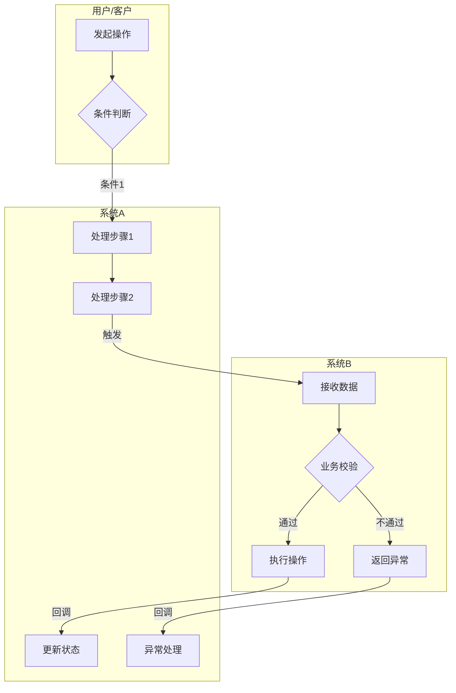
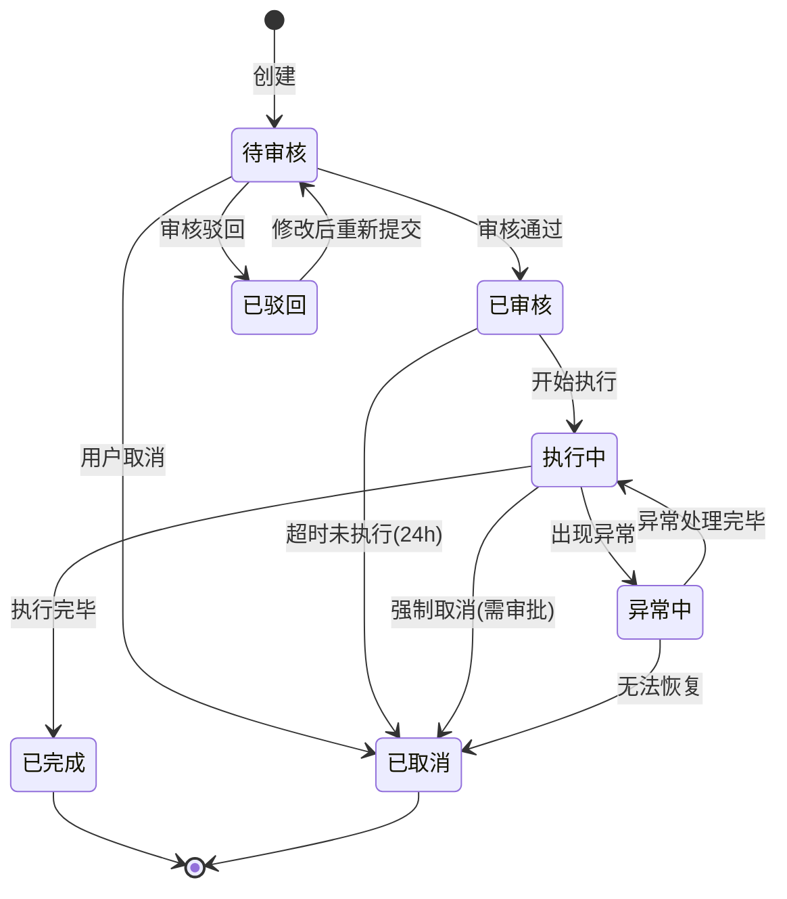
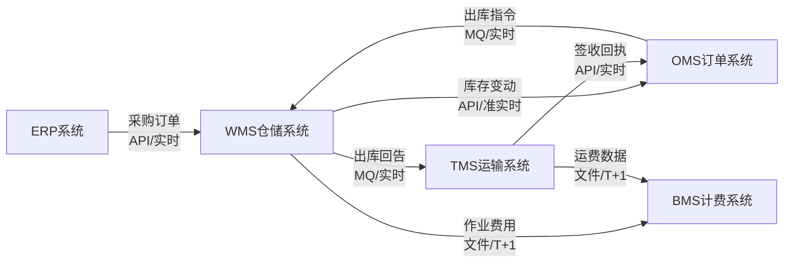
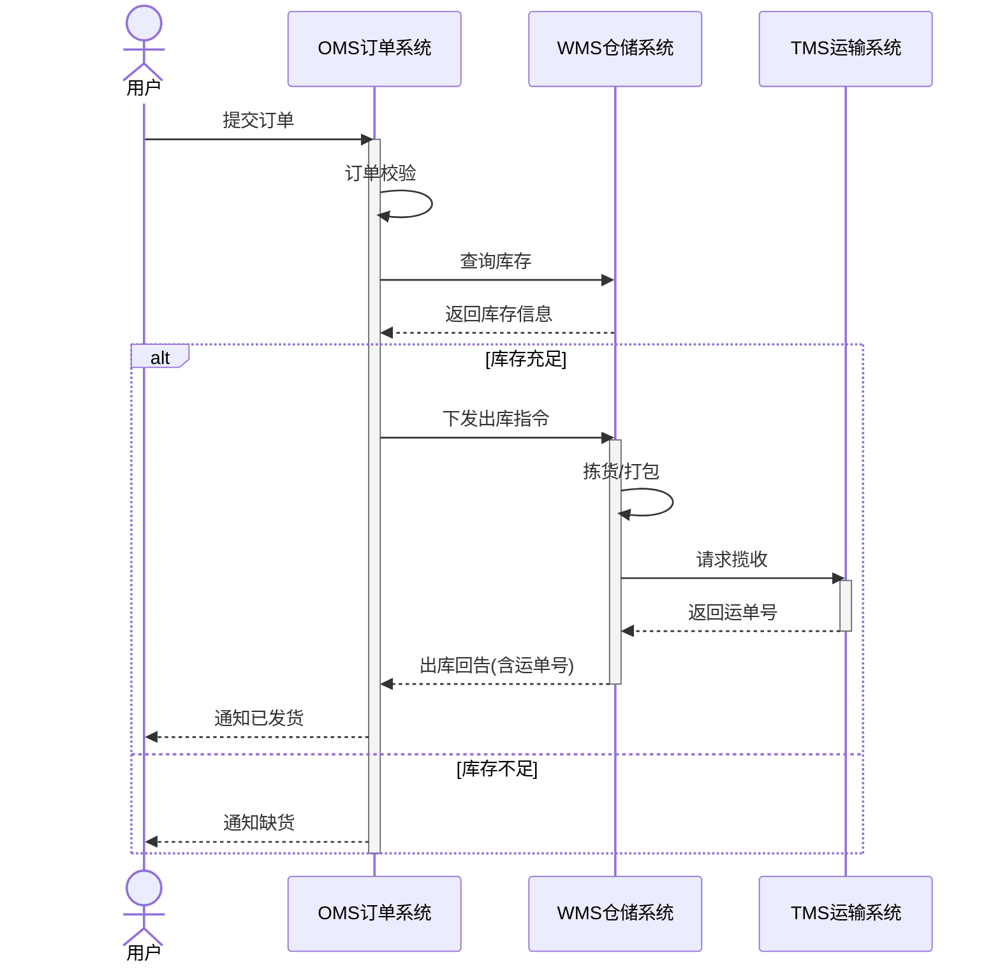
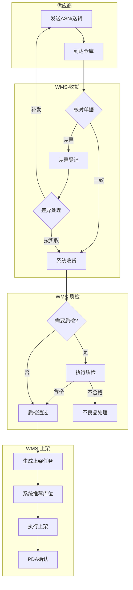
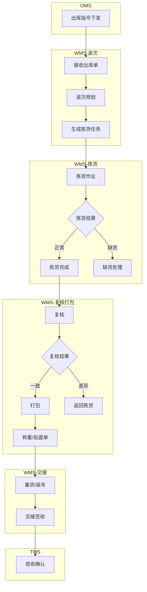
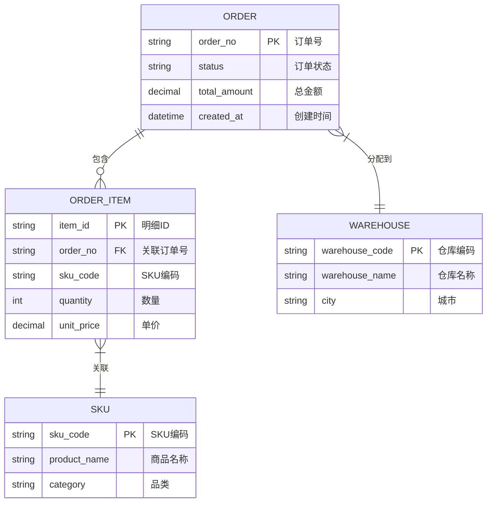

# 流程图绘制规范与模式库

## 绘制工具

根据图表复杂度和类型选择合适的格式：

**Mermaid**（状态图、时序图、数据流、简单流程）：
- 纯文本，可版本管理
- Claude Code和Claude.ai都能渲染
- 可嵌入Markdown文档
- 适合 ≤12 节点的流程图

**YAML DSL → draw.io**（泳道图、复杂流程）：
- 真正的泳道容器，精确布局
- 解决 Mermaid subgraph 无法精确控制节点位置的问题
- 通过 `yaml2drawio.py` 脚本转换为 `.drawio` 文件
- 详细 YAML 规范见 `references/diagram-yaml-schema.md`

## 图表类型选择

| 场景 | 图表类型 | 推荐格式 | 语法/工具 | 判断规则 |
|------|---------|---------|-----------|---------|
| 跨角色/跨系统的业务流程 | 泳道图 | **YAML → draw.io** | `.diagram.yaml` + `yaml2drawio.py` | 涉及 ≥2 个角色/系统的协作流程 |
| 复杂流程（>12节点+交叉连线） | 流程图 | **YAML → draw.io** | `.diagram.yaml` + `yaml2drawio.py` | 节点数 >12 或存在跨泳道交叉连线 |
| 简单泳道（≤3泳道+≤12节点） | 泳道图 | Mermaid（可选） | `graph TD` + subgraph | 泳道少且节点少时可用 Mermaid 简化 |
| 实体状态变化 | 状态机图 | Mermaid | `stateDiagram-v2` | 所有状态流转场景 |
| 系统间数据流 | 数据流图 | Mermaid | `graph LR` | 系统间数据传递关系 |
| 复杂时序交互 | 时序图 | Mermaid | `sequenceDiagram` | 系统间调用时序 |
| 系统架构概览 | 架构图 | Mermaid | `graph TD` + subgraph | 低复杂度架构展示 |
| 简单流程（≤12节点） | 流程图 | Mermaid | `graph TD` | 节点数 ≤12 且无复杂交叉 |
| 数据模型（实体关系） | ER图 | Mermaid / **YAML → draw.io** | `erDiagram` / `.diagram.yaml` | 涉及新实体或关系变更 |

## 泳道图布局约定

所有泳道图遵循以下布局规则：

- **泳道横向排列**：每条泳道是一个竖直的列，从左到右排列
- **流程从上往下**：节点在泳道列内纵向排列，跨泳道连线在列之间横向连接
- **泳道之间有清晰分隔**：每条泳道列有独立边框，相邻泳道边框形成自然的分隔线
- `lanes` 列表的定义顺序 = 从左到右的列顺序

## 模式 1: 业务泳道图

用于表达跨角色、跨系统的协作流程。

### 推荐方案：YAML → draw.io

当泳道 ≥2 个或节点 >12 个时，推荐使用 YAML DSL 描述，通过 `yaml2drawio.py` 生成 draw.io 文件。

```yaml
diagram:
  title: "跨系统协作流程"
  type: swimlane

lanes:
  - id: user
    label: "用户/客户"
  - id: sys_a
    label: "系统A"
    color: blue
  - id: sys_b
    label: "系统B"
    color: green

nodes:
  - id: a1
    label: "发起操作"
    type: process
    lane: user
  - id: a2
    label: "条件判断"
    type: decision
    lane: user
  - id: b1
    label: "处理步骤1"
    type: process
    lane: sys_a
  - id: b2
    label: "处理步骤2"
    type: process
    lane: sys_a
  - id: c1
    label: "接收数据"
    type: process
    lane: sys_b
  - id: c2
    label: "业务校验"
    type: decision
    lane: sys_b
  - id: c3
    label: "执行操作"
    type: process
    lane: sys_b
  - id: c4
    label: "返回异常"
    type: process
    lane: sys_b
    style: error
  - id: b3
    label: "更新状态"
    type: process
    lane: sys_a
  - id: b4
    label: "异常处理"
    type: process
    lane: sys_a
    style: error

edges:
  - from: a1
    to: a2
  - from: a2
    to: b1
    label: "条件1"
  - from: b1
    to: b2
  - from: b2
    to: c1
    label: "触发"
  - from: c1
    to: c2
  - from: c2
    to: c3
    label: "通过"
  - from: c2
    to: c4
    label: "不通过"
    style: error
  - from: c3
    to: b3
    label: "回调"
  - from: c4
    to: b4
    label: "回调"
    style: error
```

**YAML 规范**（详见 `references/diagram-yaml-schema.md`）：
- 每个 lane 代表一个角色或系统，支持 SCM 色板（blue/green/orange/purple）
- 节点 type 决定形状：`process` 矩形、`decision` 菱形、`start`/`end` 圆形
- `style: error` 标记异常路径（红色）、`style: async` 标记异步连线（虚线）
- 转换命令：`{python_cmd} scripts/yaml2drawio.py <file.diagram.yaml>`（`python_cmd` 为初始化时检测到的 Python 命令，如 `python3`、`python` 或 `py -3`）

### 备选方案：Mermaid 简单泳道

当泳道 ≤3 个且节点 ≤12 个时，可使用 Mermaid 作为简化版本（也适合文档内预览）：



**Mermaid 泳道规范**：
- 每个subgraph代表一个角色或系统
- 节点用中文命名，简洁明了
- 判断节点用菱形 `{}`
- 边上标注条件或数据
- 异常路径用虚线或标红（Mermaid中用style）

## 模式 2: 状态流转图

用于表达实体（订单/任务/单据）的生命周期。



**规范**：
- 状态名称用中文，简短
- 转换条件标注在箭头上
- 自动触发的转换标注触发条件（如"超时24h"）
- 终态必须明确（[*]）
- 区分正常流转和异常流转

## 模式 3: 数据流向图

用于表达系统间数据传递关系。



**规范**：
- 方向从左到右（LR）
- 节点为系统名称
- 边标注：数据内容 + 传输方式 + 时效
- 用 `<br/>` 换行保持可读

## 模式 4: 时序图

用于表达复杂的系统间交互时序。



**规范**：
- participant用中文别名
- 同步调用用实线箭头 `->>` ，返回用虚线 `-->>`
- 用 `alt/else` 表达分支
- 用 `activate/deactivate` 表达生命周期
- 关键业务判断用 `alt/else` 而不是 `opt`

## 模式 5: 供应链常见流程模板

### 入库流程框架

**推荐方案：YAML → draw.io**（跨 4 个泳道，>12 节点）：

```yaml
diagram:
  title: "入库主流程"
  type: swimlane

lanes:
  - id: supplier
    label: "供应商"
  - id: wms_recv
    label: "WMS-收货"
    color: green
  - id: wms_qc
    label: "WMS-质检"
    color: green
  - id: wms_putaway
    label: "WMS-上架"
    color: green

nodes:
  - id: s1
    label: "发送ASN/送货"
    type: process
    lane: supplier
  - id: s2
    label: "到达仓库"
    type: process
    lane: supplier
  - id: w1
    label: "核对单据"
    type: decision
    lane: wms_recv
  - id: w2
    label: "系统收货"
    type: process
    lane: wms_recv
  - id: w3
    label: "差异登记"
    type: process
    lane: wms_recv
    style: error
  - id: w4
    label: "差异处理"
    type: decision
    lane: wms_recv
  - id: q1
    label: "需要质检?"
    type: decision
    lane: wms_qc
  - id: q2
    label: "执行质检"
    type: process
    lane: wms_qc
  - id: q3
    label: "质检通过"
    type: process
    lane: wms_qc
  - id: q4
    label: "不良品处理"
    type: process
    lane: wms_qc
    style: error
  - id: p1
    label: "生成上架任务"
    type: process
    lane: wms_putaway
  - id: p2
    label: "系统推荐库位"
    type: process
    lane: wms_putaway
  - id: p3
    label: "执行上架"
    type: process
    lane: wms_putaway
  - id: p4
    label: "PDA确认"
    type: process
    lane: wms_putaway

edges:
  - from: s1
    to: s2
  - from: s2
    to: w1
  - from: w1
    to: w2
    label: "一致"
  - from: w1
    to: w3
    label: "差异"
    style: error
  - from: w3
    to: w4
  - from: w4
    to: s1
    label: "补发"
  - from: w4
    to: w2
    label: "按实收"
  - from: w2
    to: q1
  - from: q1
    to: q2
    label: "是"
  - from: q1
    to: q3
    label: "否"
  - from: q2
    to: q3
    label: "合格"
  - from: q2
    to: q4
    label: "不合格"
    style: error
  - from: q3
    to: p1
  - from: p1
    to: p2
  - from: p2
    to: p3
  - from: p3
    to: p4
```

**Mermaid 简化版本**（用于文档内预览）：



### 出库流程框架

**推荐方案：YAML → draw.io**（完整 YAML 示例见 `references/diagram-yaml-schema.md`）：

```yaml
diagram:
  title: "出库主流程"
  type: swimlane

lanes:
  - id: oms
    label: "OMS 订单系统"
    color: blue
  - id: wms_wave
    label: "WMS-波次"
    color: green
  - id: wms_pick
    label: "WMS-拣货"
    color: green
  - id: wms_check
    label: "WMS-复核打包"
    color: green
  - id: tms
    label: "TMS 运输系统"
    color: orange

nodes:
  - id: o1
    label: "出库指令下发"
    type: process
    lane: oms
  - id: w1
    label: "接收出库单"
    type: process
    lane: wms_wave
  - id: w2
    label: "波次规划"
    type: process
    lane: wms_wave
  - id: w3
    label: "生成拣货任务"
    type: process
    lane: wms_wave
  - id: p1
    label: "拣货作业"
    type: process
    lane: wms_pick
  - id: p2
    label: "拣货结果"
    type: decision
    lane: wms_pick
  - id: p3
    label: "拣货完成"
    type: process
    lane: wms_pick
  - id: p4
    label: "缺货处理"
    type: process
    lane: wms_pick
    style: error
  - id: r1
    label: "复核"
    type: process
    lane: wms_check
  - id: r2
    label: "复核结果"
    type: decision
    lane: wms_check
  - id: r3
    label: "打包"
    type: process
    lane: wms_check
  - id: r4
    label: "返回拣货"
    type: process
    lane: wms_check
    style: error
  - id: r5
    label: "称重/贴面单"
    type: process
    lane: wms_check
  - id: h1
    label: "集货/装车"
    type: process
    lane: wms_check
  - id: h2
    label: "交接签收"
    type: process
    lane: wms_check
  - id: t1
    label: "揽收确认"
    type: process
    lane: tms

edges:
  - from: o1
    to: w1
  - from: w1
    to: w2
  - from: w2
    to: w3
  - from: w3
    to: p1
  - from: p1
    to: p2
  - from: p2
    to: p3
    label: "正常"
  - from: p2
    to: p4
    label: "缺货"
    style: error
  - from: p3
    to: r1
  - from: r1
    to: r2
  - from: r2
    to: r3
    label: "一致"
  - from: r2
    to: r4
    label: "差异"
    style: error
  - from: r3
    to: r5
  - from: r5
    to: h1
  - from: h1
    to: h2
  - from: h2
    to: t1
```

**Mermaid 简化版本**（用于文档内预览）：



## 模式 6: ER 关系图

用于表达数据模型中的实体关系。在以下场景生成：新建系统、新增实体、实体关系变更。

### Mermaid ER 图



**规范**：
- 实体名称使用大写英文（如 ORDER, WAREHOUSE）
- 字段注释使用中文
- 标注 PK（主键）和 FK（外键）
- 关系线上标注中文业务含义
- 关系类型：`||--||` 一对一、`||--o{` 一对多、`}o--o{` 多对多

### YAML → draw.io ER 图

当实体数 >5 或关系复杂时，使用 YAML DSL 描述 ER 图（详见 `references/diagram-yaml-schema.md` 中的 ER 图类型定义）：

```yaml
diagram:
  title: "订单数据模型"
  type: er

entities:
  - id: order
    label: "订单 ORDER"
    color: blue
    fields:
      - name: order_no
        type: string
        pk: true
        comment: "订单号"
      - name: status
        type: string
        comment: "订单状态"
      - name: warehouse_code
        type: string
        fk: warehouse
        comment: "分配仓库"

  - id: order_item
    label: "订单明细 ORDER_ITEM"
    color: blue
    fields:
      - name: item_id
        type: string
        pk: true
        comment: "明细ID"
      - name: order_no
        type: string
        fk: order
        comment: "关联订单"

  - id: warehouse
    label: "仓库 WAREHOUSE"
    color: green
    fields:
      - name: warehouse_code
        type: string
        pk: true
        comment: "仓库编码"
      - name: warehouse_name
        type: string
        comment: "仓库名称"

relationships:
  - from: order
    to: order_item
    type: "1:N"
    label: "包含"
  - from: order
    to: warehouse
    type: "N:1"
    label: "分配到"
```

**ER 图文件命名**：`diagrams/er-{模块名}.mermaid` 或 `diagrams/er-{模块名}.diagram.yaml`

**ER 图生成触发规则**：

| 场景 | 是否生成 ER 图 |
|------|--------------|
| 新建系统（requirement_type=new） | **必须** |
| 新增实体 | **必须** |
| 实体关系变更（如 1:N 改 N:M） | **必须** |
| 仅字段变更（无新实体、无关系变更） | 不生成，用 §7.3 字段变更表 |
| 无数据模型变更 | 不生成 |

## 图表规划

### 图表服务于 PRD 表达意图

每张图应回答一个明确的问题。先确定要回答什么问题，再决定画什么内容：

| PRD 表达意图 | 图表应包含的内容 | 典型结果 |
|------------|----------------|---------|
| "新功能如何嵌入现有流程" | 现有流程全貌 + 新增/变更步骤（高亮） | 1 张完整泳道图，变更点用 highlight 标注 |
| "新增的独立流程长什么样" | 新流程本身 | 1 张独立流程图 |
| "系统间如何交互" | 涉及的系统、接口调用顺序 | 时序图或数据流图 |
| "状态如何流转" | 状态集合 + 转换条件 | 状态图 |

### 图表成本收益（每张图都要过这个判断）

| 判断问题 | 答"是" → 画 | 答"否" → 不画 |
|---------|------------|-------------|
| 这里的逻辑用文字是否散乱难懂，图能一目了然？ | 画 | 文字足够则不画 |
| 这张图是否传递了文字无法替代的信息（空间关系、并行性、状态转换）？ | 画 | 与文字重复则冗余 |
| 读者是否需要反复参照这张图来理解后续章节？ | 画（高复用） | 一次性信息用文字 |
| 整个 PRD 已有的图是否足够覆盖？再加一张边际收益如何？ | 酌情 | 边际递减则不加 |

### 各类图的适用时机

| 图表类型 | 什么时候画 | 什么时候不画 |
|---------|----------|------------|
| **泳道流程图** | 跨系统协作 + 有分支/交互；变更类需求需展示改动在全局中的位置 | 纯线性传递、单系统简单步骤 |
| **状态图** | 实体状态 ≥3 个，状态转换有条件约束 | 两态开关、转换逻辑简单 |
| **时序图** | 需表达系统间调用的时间先后和并行性 | A→B→C 同步链，流程图已清晰 |
| **ER 图** | 新增实体 或 实体关系变更（如 1:N→N:M） | 仅字段增减，无新实体或关系变更 |
| **数据流图** | 需展示数据在系统间的流向和转换 | 与流程图信息重复 |

### 变更类需求的图表范围

当 `requirement_type = update|mixed` 时，图的范围不是"整个系统全流程"，而是**变更点 + 周边上下文**：

- **小改动**（如某个节点增加一个判断）：只画该节点所在的局部流程段 + 上下游各 1-2 步，用 highlight 标注变更点
- **中等改动**（如新增一个子流程嵌入现有流程）：画从切入点到回归点的完整路径，现有步骤正常色，新增步骤 highlight
- **大改动**（如全新的跨系统流程）：画完整流程，此时接近 `requirement_type = new` 的画法

### 全局图表策略（PRD 规划阶段决定）

在 PRD 大纲规划阶段，一次性决定整个 PRD 需要哪些图：

1. 列出候选图表（哪些章节可能需要图）
2. 对每张候选图过"成本收益"判断，砍掉不必要的
3. 确定最终图表清单（类型 + 范围 + 对应章节），写入 PRD 大纲的"图表规划"部分
4. 之后按清单逐张生成，不在撰写过程中临时加图

### 图内重组（优先于拆分）

当一张图连线复杂但仍在服务同一个表达意图时，**先尝试在图内重组**，而非拆分：

**策略 1: 展开耦合节点** — 一个节点同时触发多个系统 → 拆成发送/接收两个节点各归其泳道，连线从扇出变为一对一

**策略 2: 增加泳道分离职责** — 多个系统的逻辑混在同一泳道 → 增加泳道让各系统步骤各在自己列中

**策略 3: 区分主次流程** — 主流程用正常样式，辅助/回调流程用 `style: async`（虚线），视觉上区分主干和支线

### 何时拆分（图内重组仍不够时）

**不拆的原则**：如果一张图在回答同一个问题，即使节点多也不拆——拆开丢失上下文。

**拆分的信号**：
- 同一张图试图回答**两个不同读者的不同问题**（概览 vs 细节，正常流程 vs 异常处理）
- 同一系统的两个**无公共节点**的独立功能被画在了一张图里

**拆分结构（两层，不更深）**：
- 概览图（1 张）：subprocess 节点代表可展开的子流程，≤10 节点
- 子流程图（2-3 张）：标明入口/出口，不再拆分
- 命名：概览 `{name}.diagram.yaml`，子流程 `{name}-{sub}.diagram.yaml`
- PRD 组织：先概览 + 全局描述，再按子流程逐节展开

---

## 绘制注意事项

1. **节点命名**：使用"动宾短语"（如"创建订单"而非"订单创建"）
2. **图表大小**：单张图建议不超过 20 个节点。超过时不强制拆分，而是评估是否仍在服务同一个表达意图（详见"图表规划"章节）
3. **子图标题**：使用系统/角色名称，不用"步骤1""阶段2"
4. **条件标注**：判断分支必须穷举，不能只有"是"没有"否"
5. **异常路径**：必须画出主要异常路径，不能只画happy path
6. **文件保存**：每张图单独保存到 `diagrams/` 目录，文件名与图表标题对应
   - Mermaid 图表：保存为 `.mermaid` 文件
   - YAML 泳道图/复杂流程：保存为 `.diagram.yaml` 文件，转换后生成同名 `.drawio` 文件
   - 示例：`diagrams/main-flow.diagram.yaml` → `diagrams/main-flow.drawio`

---

## draw.io 生成降级策略（DG-01）

当需要生成 YAML → draw.io 格式的图表但环境不满足时，按以下流程处理。核心原则：**尽最大努力生成 draw.io，失败时清晰告知原因并提供降级方案，绝不因图表问题阻断 PRD 输出**。

### 首次触发时机

在 PRD 撰写过程中，首次遇到需要生成 YAML → draw.io 的图表（泳道图、>12节点流程、>5实体ER图）且 `python_available = false` 时触发。

### 第一步：告知原因并提供安装引导

使用 `AskUserQuestion`：

> header: "图表依赖"
> 问题: "泳道图/复杂流程图需要 Python + PyYAML 环境来生成 .drawio 文件，但当前未检测到可用环境。\n\n请选择处理方式："
> 选项：
> - **安装依赖（推荐）**：我来帮你尝试安装 Python 环境和 PyYAML
> - **仅保留 YAML 源文件**：输出 .diagram.yaml 但不生成 .drawio，你可以稍后手动转换
> - **改用 Mermaid**：使用 Mermaid subgraph 替代泳道图（布局精度会降低）

### 第二步：尝试安装（用户选择"安装依赖"时）

按以下顺序尝试安装，**每步失败后立即告知用户原因**：

1. 先检查 Python 是否已安装但缺少 PyYAML：
   - `python3 --version`（或 `python --version`、`py -3 --version`）
   - 如 Python 存在但 `import yaml` 失败 → 提示 `{python_cmd} -m pip install pyyaml`
   - 如 Python 不存在 → 告知用户需要先安装 Python 3.8+

2. 尝试安装 PyYAML：
   - `{python_cmd} -m pip install pyyaml`
   - 安装成功 → 重新验证 `{python_cmd} -c "import yaml; print('ok')"` → 更新 `python_available = true`、`python_cmd`
   - 安装失败 → 记录失败原因（权限不足 / pip 不可用 / 网络问题），告知用户

3. **安装成功**：通知用户"环境已就绪"，后续自动生成 .drawio，继续 PRD 流程
4. **安装失败**：告知具体原因，进入第三步

### 第三步：安装失败后的降级选择

安装失败后，使用 `AskUserQuestion`：

> header: "安装未成功"
> 问题: "{具体失败原因}。\n\n你可以稍后手动安装后重新运行，或选择降级方案继续："
> 选项：
> - **仅保留 YAML 源文件**：输出 .diagram.yaml，后续可通过 `python yaml2drawio.py` 手动转换
> - **改用 Mermaid**：使用 Mermaid subgraph 替代（布局精度会降低）

用户选择后，**记录本次会话的降级决策**（`diagram_fallback = yaml_only | mermaid`），后续同类图表不再重复询问，直接按选定方案执行。

### 降级后的行为

- **yaml_only 模式**：生成 `.diagram.yaml` 源文件，在 PRD 中以文字描述"流程图见 `diagrams/xxx.diagram.yaml`，需 Python 环境转换为 .drawio"替代图表占位
- **mermaid 模式**：将泳道图改用 Mermaid `graph TD` + `subgraph` 实现，标注"此图为 Mermaid 简化版，精确泳道版需 Python 环境"
- 两种降级模式下，PRD 文档末尾增加提示："本PRD中部分图表因环境限制使用了降级格式，安装 Python + PyYAML 后可运行 `python scripts/export-diagrams.py diagrams/` 生成完整 .drawio 文件"

### yaml2drawio.py 运行时错误处理

即使 `python_available = true`，`yaml2drawio.py` 转换仍可能因 YAML 语法错误、节点引用错误等失败。此时：

1. 读取错误输出，**自动修复** YAML 中的问题（拼写错误、缺失引用等）
2. 重试转换（最多 2 次自动修复重试）
3. 仍然失败 → 保留 `.diagram.yaml` 源文件，告知用户"draw.io 转换失败，已保留 YAML 源文件，错误信息：{具体错误}"
4. **不阻断 PRD 流程**，继续后续章节撰写

---

## 图表质量校验（自动 + AI 双层）

图表生成后、导出前，执行双层质量校验。**整个校验-修复过程对用户透明**，用户只看到最终输出的图表文件，不看到中间的检测和修复过程。

**第一层：脚本自动检测 + 自动修正（生成时，<10ms）**

`compute_edge_ports()` 在计算端口时**内置自动修正**，先修 V-4（方向绕路）再修 V-1（出口重叠），确保大多数几何问题在生成阶段就已消除。`validate_edge_layout()` 在修正后再次检测残留问题：

| 编号 | 检查项 | 脚本自动修正 | 残留时的 AI 处理 |
|------|--------|------------|----------------|
| V-1 | 同出口重叠 | ✅ 轮转分配不同端口 | 如仍残留：调整边顺序或拆分节点 |
| V-2 | 路径穿越节点 | ❌ 需改 YAML 结构 | 调整节点层级或拆图 |
| V-3 | 标签重叠 | ❌ 需改标签文字 | 缩短标签或调整边顺序 |
| V-4 | 方向绕路 | ✅ 翻转 exit 方向 | 如因 V-1 折中无法修正：评估是否需要拆图 |

**第二层：AI 静默修复（撰写时，用户无感知）**

在 PRD 撰写阶段生成每张 `.diagram.yaml` 后，AI **内部**执行以下检查-修复闭环，**不向用户展示中间过程**：

1. 运行 `yaml2drawio.py` / `yaml2svg.py` 生成图表，读取 stderr 中的 V-1~V-4 警告
2. 如有残留警告（V-2/V-3 或 V-1/V-4 因冲突无法自动修正）：
   - 分析警告原因
   - **直接修改 `.diagram.yaml`**（调整边顺序、缩短标签、调整节点层级、或拆分为多张图）
   - 重新运行生成脚本
3. AI 同时读 `.diagram.yaml` 源文件检查**语义合理性**：
   - 决策节点是否遗漏了分支（如只有"是"没有"否"）
   - 流程是否有孤立节点（无入边也无出边）
   - 跨泳道连线是否符合实际系统交互方向
   - 如发现问题，同样**直接修改 YAML 并重新生成**
4. 最多 **2 轮**自动修正。仍有残留警告则保留当前版本
5. **最终输出给用户的只有**：生成完成的图表文件（`.diagram.yaml` + `.drawio` + `.svg`）
6. 修复历史记录到 `review-report.md` 的"图表质量"章节（供事后追溯，不主动展示）

**原则**：用户感知到的是"图表直接就生成好了"，不需要知道中间经历了几轮检测和修正。只有在 2 轮修正后仍有严重问题（V-2 路径穿越）时，才在交付阶段简要提示用户可在 draw.io 中手动微调。
