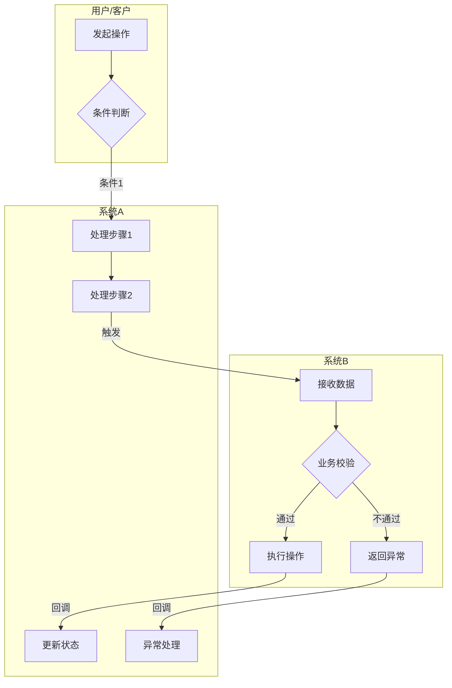
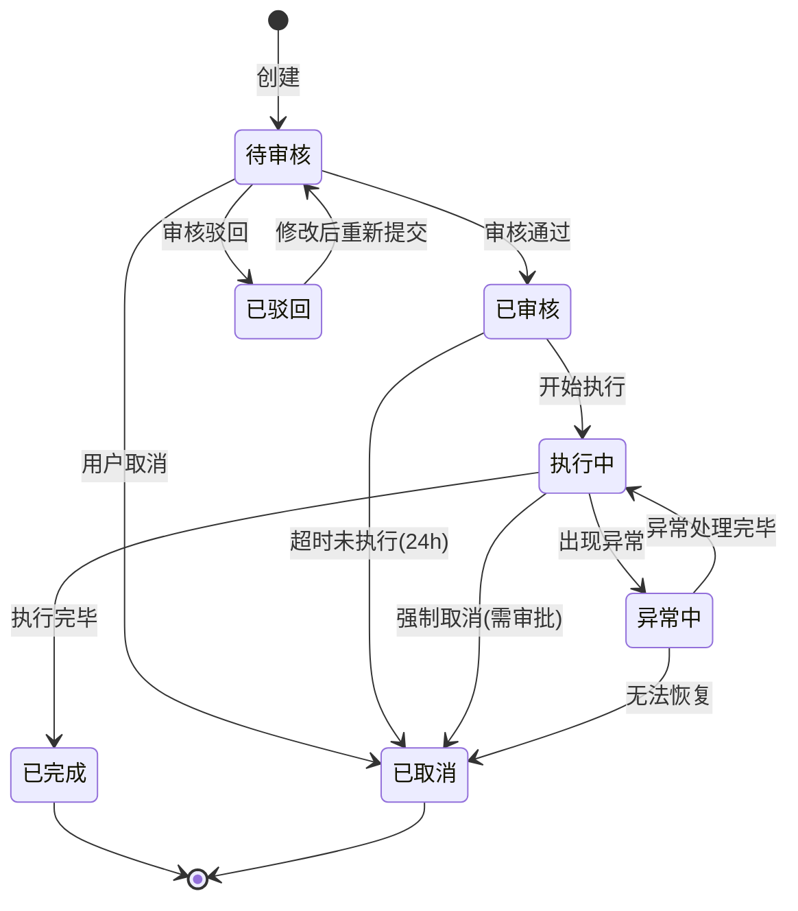
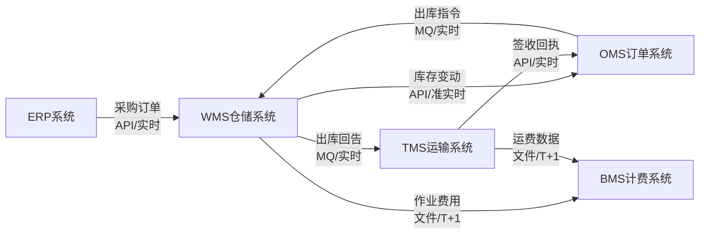
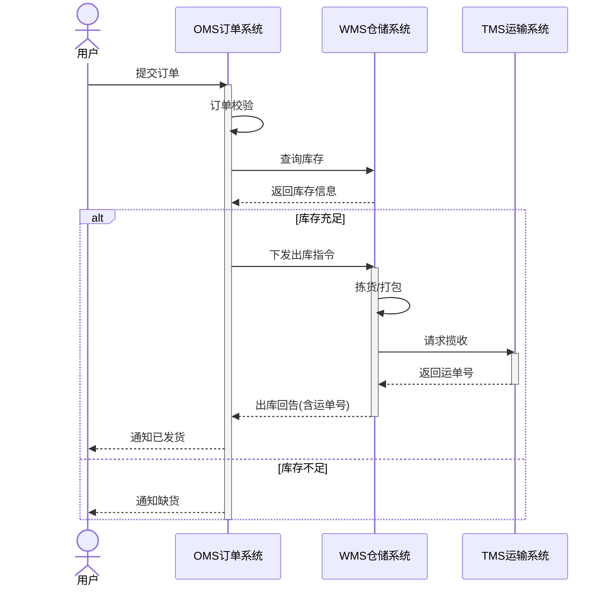
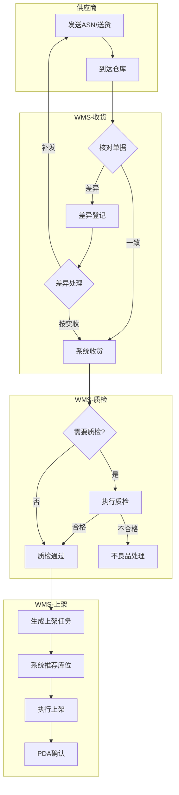
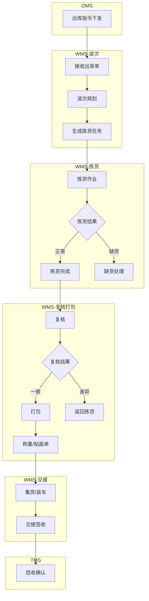

# 流程图绘制规范与模式库

## 绘制工具

统一使用Mermaid语法。原因：
- 纯文本，可版本管理
- Claude Code和Claude.ai都能渲染
- 可嵌入Markdown文档
- 可导出为图片

## 图表类型选择

| 场景 | 图表类型 | Mermaid语法 |
|------|---------|------------|
| 跨角色/跨系统的业务流程 | 泳道图 | `graph TD` + subgraph |
| 实体状态变化 | 状态机图 | `stateDiagram-v2` |
| 系统间数据流 | 数据流图 | `graph LR` |
| 复杂时序交互 | 时序图 | `sequenceDiagram` |
| 系统架构概览 | 架构图 | `graph TD` + subgraph |

## 模式 1: 业务泳道图

用于表达跨角色、跨系统的协作流程。

**规范**：
- 每个subgraph代表一个角色或系统
- 节点用中文命名，简洁明了
- 判断节点用菱形 `{}`
- 边上标注条件或数据
- 异常路径用虚线或标红（Mermaid中用style）

## 模式 2: 状态流转图

用于表达实体（订单/任务/单据）的生命周期。

**规范**：
- 状态名称用中文，简短
- 转换条件标注在箭头上
- 自动触发的转换标注触发条件（如"超时24h"）
- 终态必须明确（[*]）
- 区分正常流转和异常流转

## 模式 3: 数据流向图

用于表达系统间数据传递关系。

**规范**：
- 方向从左到右（LR）
- 节点为系统名称
- 边标注：数据内容 + 传输方式 + 时效
- 用 ` ` 换行保持可读

## 模式 4: 时序图

用于表达复杂的系统间交互时序。

**规范**：
- participant用中文别名
- 同步调用用实线箭头 `->>` ，返回用虚线 `-->>`
- 用 `alt/else` 表达分支
- 用 `activate/deactivate` 表达生命周期
- 关键业务判断用 `alt/else` 而不是 `opt`

## 模式 5: 供应链常见流程模板

### 入库流程框架

### 出库流程框架

## 绘制注意事项

1. **节点命名**：使用"动宾短语"（如"创建订单"而非"订单创建"）
2. **图表大小**：单张图不超过20个节点，超过则拆分
3. **子图标题**：使用系统/角色名称，不用"步骤1""阶段2"
4. **条件标注**：判断分支必须穷举，不能只有"是"没有"否"
5. **异常路径**：必须画出主要异常路径，不能只画happy path
6. **文件保存**：每张图单独保存为 `.mermaid` 文件，文件名与图表标题对应
