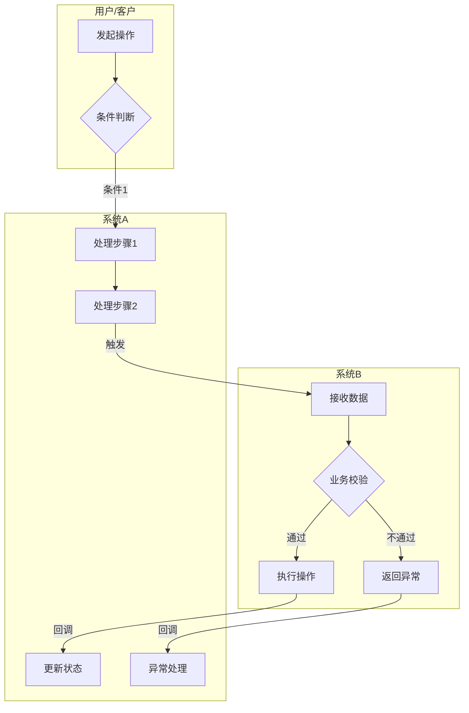
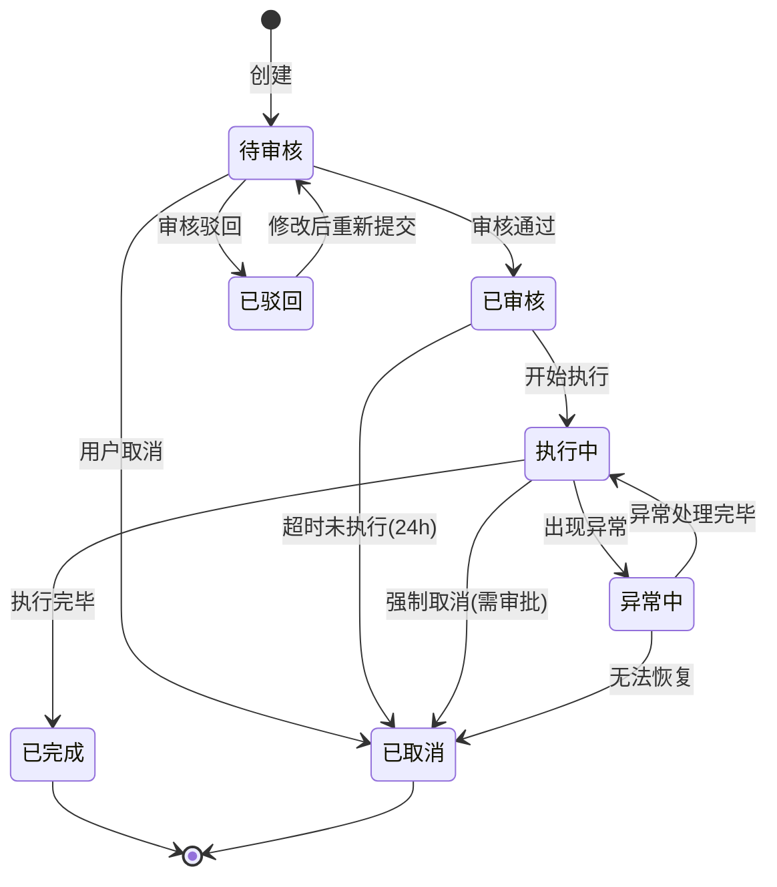
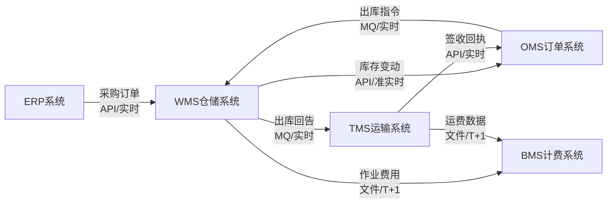
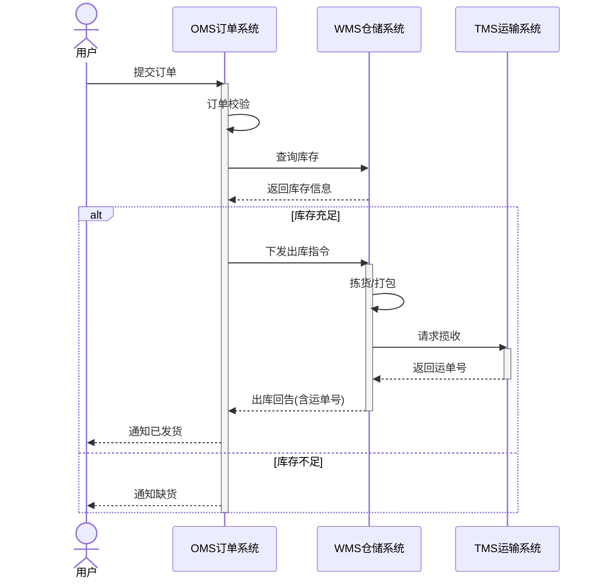
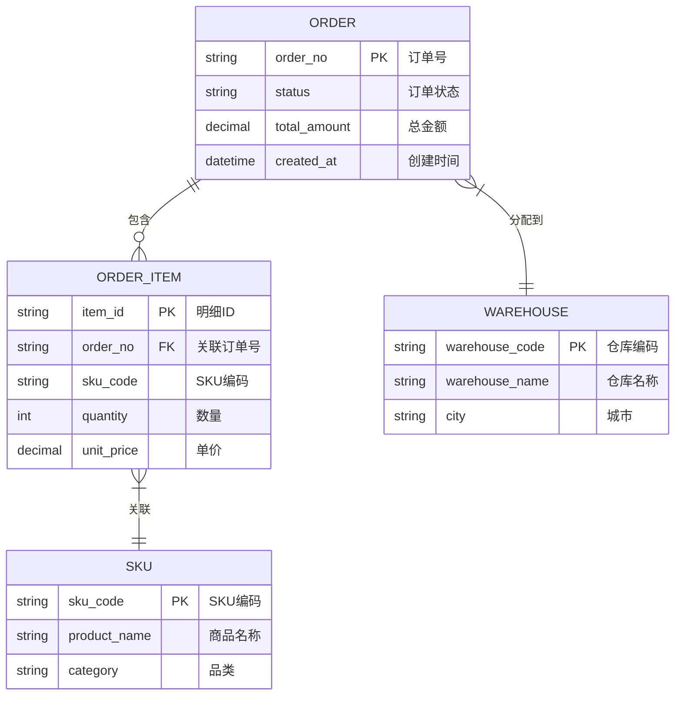

# 图表模式示例库

按需查阅：仅在生成特定类型图表时读取对应模式的示例。

---

## 模式 1: 业务泳道图

用于表达跨角色、跨系统的协作流程。

### 推荐方案：YAML → draw.io

当泳道 ≥2 个或节点 >12 个时，推荐使用 YAML DSL 描述，通过 `yaml2drawio.py` 生成 draw.io 文件。

```yaml
diagram:
  title: "跨系统协作流程"
  type: swimlane

lanes:
  - id: user
    label: "用户/客户"
  - id: sys_a
    label: "系统A"
    color: blue
  - id: sys_b
    label: "系统B"
    color: green

nodes:
  - id: a1
    label: "发起操作"
    type: process
    lane: user
  - id: a2
    label: "条件判断"
    type: decision
    lane: user
  - id: b1
    label: "处理步骤1"
    type: process
    lane: sys_a
  - id: b2
    label: "处理步骤2"
    type: process
    lane: sys_a
  - id: c1
    label: "接收数据"
    type: process
    lane: sys_b
  - id: c2
    label: "业务校验"
    type: decision
    lane: sys_b
  - id: c3
    label: "执行操作"
    type: process
    lane: sys_b
  - id: c4
    label: "返回异常"
    type: process
    lane: sys_b
    style: error
  - id: b3
    label: "更新状态"
    type: process
    lane: sys_a
  - id: b4
    label: "异常处理"
    type: process
    lane: sys_a
    style: error

edges:
  - from: a1
    to: a2
  - from: a2
    to: b1
    label: "条件1"
  - from: b1
    to: b2
  - from: b2
    to: c1
    label: "触发"
  - from: c1
    to: c2
  - from: c2
    to: c3
    label: "通过"
  - from: c2
    to: c4
    label: "不通过"
    style: error
  - from: c3
    to: b3
    label: "回调"
  - from: c4
    to: b4
    label: "回调"
    style: error
```

**YAML 规范**（详见 `references/diagram-yaml-schema.md`）：
- 每个 lane 代表一个角色或系统，支持 SCM 色板（blue/green/orange/purple）
- 节点 type 决定形状：`process` 矩形、`decision` 菱形、`start`/`end` 圆形
- `style: error` 标记异常路径（红色）、`style: async` 标记异步连线（虚线）
- 转换命令：`{python_cmd} scripts/yaml2drawio.py <file.diagram.yaml>`（`python_cmd` 为初始化时检测到的 Python 命令，如 `python3`、`python` 或 `py -3`）

### 备选方案：Mermaid 简单泳道

当泳道 ≤3 个且节点 ≤12 个时，可使用 Mermaid 作为简化版本（也适合文档内预览）：



**Mermaid 泳道规范**：
- 每个subgraph代表一个角色或系统
- 节点用中文命名，简洁明了
- 判断节点用菱形 `{}`
- 边上标注条件或数据
- 异常路径用虚线或标红（Mermaid中用style）

## 模式 2: 状态流转图

用于表达实体（订单/任务/单据）的生命周期。



**规范**：
- 状态名称用中文，简短
- 转换条件标注在箭头上
- 自动触发的转换标注触发条件（如"超时24h"）
- 终态必须明确（[*]）
- 区分正常流转和异常流转

## 模式 3: 数据流向图

用于表达系统间数据传递关系。



**规范**：
- 方向从左到右（LR）
- 节点为系统名称
- 边标注：数据内容 + 传输方式 + 时效
- 用 `<br/>` 换行保持可读

## 模式 4: 时序图

用于表达复杂的系统间交互时序。



**规范**：
- participant用中文别名
- 同步调用用实线箭头 `->>` ，返回用虚线 `-->>`
- 用 `alt/else` 表达分支
- 用 `activate/deactivate` 表达生命周期
- 关键业务判断用 `alt/else` 而不是 `opt`

## 模式 5: 供应链常见流程模板

### 入库流程框架

4 泳道（供应商→收货→质检→上架），14 节点，含差异处理和不良品异常路径。

**完整 YAML + Mermaid 示例**：读取 `references/examples/scm-inbound-flow.yaml`

**结构要点**：供应商 → 单据核对(决策) → 系统收货 → 质检(决策) → 上架(PDA确认)。差异路径用 `style: error` 标红。

### 出库流程框架

5 泳道（OMS→波次→拣货→复核打包→TMS），17 节点，含缺货和复核差异异常路径。

**完整 YAML + Mermaid 示例**：读取 `references/examples/scm-outbound-flow.yaml`

**结构要点**：OMS下发 → 波次规划 → 拣货(缺货决策) → 复核(差异决策) → 打包→称重→集货→交接 → TMS揽收。

## 模式 6: ER 关系图

用于表达数据模型中的实体关系。在以下场景生成：新建系统、新增实体、实体关系变更。

### Mermaid ER 图



**规范**：
- 实体名称使用大写英文（如 ORDER, WAREHOUSE）
- 字段注释使用中文
- 标注 PK（主键）和 FK（外键）
- 关系线上标注中文业务含义
- 关系类型：`||--||` 一对一、`||--o{` 一对多、`}o--o{` 多对多

### YAML → draw.io ER 图

当实体数 >5 或关系复杂时，使用 YAML DSL 描述 ER 图（详见 `references/diagram-yaml-schema.md` 中的 ER 图类型定义）：

```yaml
diagram:
  title: "订单数据模型"
  type: er

entities:
  - id: order
    label: "订单 ORDER"
    color: blue
    fields:
      - name: order_no
        type: string
        pk: true
        comment: "订单号"
      - name: status
        type: string
        comment: "订单状态"
      - name: warehouse_code
        type: string
        fk: warehouse
        comment: "分配仓库"

  - id: order_item
    label: "订单明细 ORDER_ITEM"
    color: blue
    fields:
      - name: item_id
        type: string
        pk: true
        comment: "明细ID"
      - name: order_no
        type: string
        fk: order
        comment: "关联订单"

  - id: warehouse
    label: "仓库 WAREHOUSE"
    color: green
    fields:
      - name: warehouse_code
        type: string
        pk: true
        comment: "仓库编码"
      - name: warehouse_name
        type: string
        comment: "仓库名称"

relationships:
  - from: order
    to: order_item
    type: "1:N"
    label: "包含"
  - from: order
    to: warehouse
    type: "N:1"
    label: "分配到"
```

**ER 图文件命名**：`diagrams/er-{模块名}.mermaid` 或 `diagrams/er-{模块名}.diagram.yaml`

**ER 图生成触发规则**：

| 场景 | 是否生成 ER 图 |
|------|--------------|
| 新建系统（requirement_type=new） | **必须** |
| 新增实体 | **必须** |
| 实体关系变更（如 1:N 改 N:M） | **必须** |
| 仅字段变更（无新实体、无关系变更） | 不生成，用 §7.3 字段变更表 |
| 无数据模型变更 | 不生成 |

