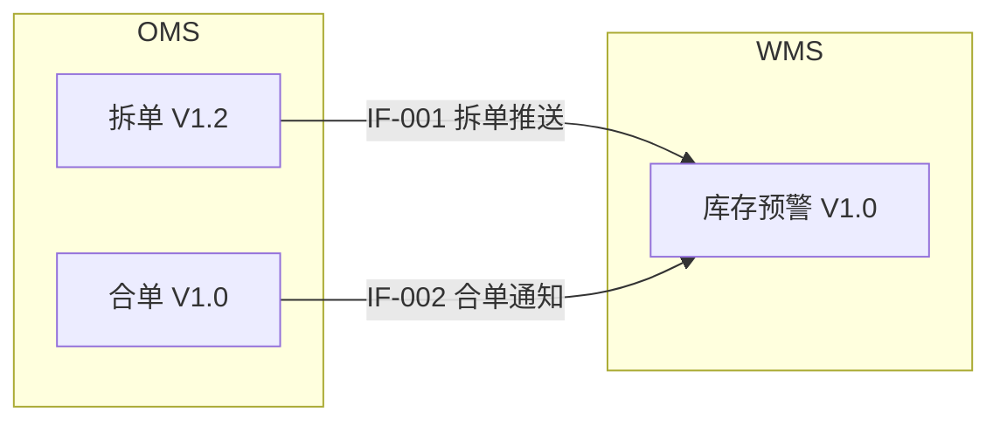

# Phase 4: 自检与审查 — 检查清单

**进度播报**（交互模式）：进入本阶段时输出 `▰▰▰▰▰▱ [5/{total}] 自检审查`。多轮审阅迭代期间步骤编号不变。

## 目标

在将PRD交付给用户前，系统化地检查文档质量，减少遗漏和错误。

## 检查执行方式

1. 重新读取完整的PRD文档
2. 逐项执行以下检查
3. 每项检查记录结果：通过/关键/一般/警告
4. 生成 review-report.md

## 检查清单

### CK-0: 需求回溯检查

逐条核对 intake.md（或轻量模式下用户原始输入）中提出的痛点和目标，确认 PRD 中有对应的解决方案。

| 检查项 | 检查方法 | 严重性 |
|--------|---------|--------|
| CK-0.1 | intake.md 中的每个痛点（§痛点）是否在 PRD 中有对应的功能或流程改进来解决 | 关键 |
| CK-0.2 | intake.md 中的每个目标（G-XXX）是否在 PRD 中有可衡量的实现路径 | 关键 |
| CK-0.3 | 用户原始描述中的核心诉求是否全部在 PRD 范围内覆盖（未被遗漏或降级处理） | 关键 |

### CK-1: 完整性检查

| 检查项 | 检查方法 | 严重性 |
|--------|---------|--------|
| CK-1.1 | PRD 的章节是否覆盖了叙事规划中标为"展开"或"标准"的维度。**注意**：叙事规划中标为"省略"的维度不生成对应章节（由PRD尾部统一说明），不视为缺失 | 一般 |
| CK-1.2 | intake.md中的每个需求点是否都在PRD中有体现 | 关键 |
| CK-1.3 | clarification.md中每个[已确认]的决策是否都反映在PRD中 | 关键 |
| CK-1.4 | 每个功能点是否都有异常处理描述 | 关键 |
| CK-1.5 | 每个功能点是否都有对应的验收标准 | 关键 |
| CK-1.6 | 涉及的每个接口是否都有完整的参数定义 | 警告 |
| CK-1.7 | 流程图中的每个节点是否都有文字说明 | 警告 |
| CK-1.8 | 章节编号是否从第1章连续递增，无跳号（裁剪章节后编号应重排） | 警告 |

### CK-2: 一致性检查

| 检查项 | 检查方法 | 严重性 |
|--------|---------|--------|
| CK-2.1 | 文档内术语使用是否一致（同一概念是否用了不同名称） | 一般 |
| CK-2.2 | 流程图与文字描述的步骤是否一一对应 | 关键 |
| CK-2.3 | 状态流转图中的状态名称与功能明细中的是否一致 | 关键 |
| CK-2.4 | 不同章节中对同一业务规则的描述是否一致 | 关键 |
| CK-2.5 | 接口字段与数据实体定义是否一致 | 警告 |
| CK-2.6 | 验收标准中引用的功能点编号（F-XXX）和目标编号（G-XXX）是否正确 | 警告 |
| CK-2.6a | 交叉引用完整性（分层检查）：**必查** — G-XX 和 F-XXX 是否在定义位置和引用位置成对出现；**按需** — C-XX（update/mixed 类型时）和 IF-XXX（有接口时）是否成对出现。规则和异常使用局部编号，不纳入全局交叉引用检查 | 关键 |
| CK-2.7 | draw.io 图中所有节点是否有对应文字说明 | 警告 |
| CK-2.8 | YAML 图表中的 lane/node 标签是否与 PRD 文字中的系统/角色名称一致 | 警告 |
| CK-2.9 | ER 图中的实体名称和字段名称是否与 PRD 正文中的术语一致 | 警告 |

### CK-3: 业务规则检查

| 检查项 | 检查方法 | 严重性 |
|--------|---------|--------|
| CK-3.1 | 每个功能点的业务规则是否有明确的触发条件 | 关键 |
| CK-3.2 | 每个功能点的业务规则是否有明确的处理逻辑（不含模糊表述） | 关键 |
| CK-3.3 | 规则之间是否有逻辑冲突 | 关键 |
| CK-3.4 | 边界条件是否覆盖（数量为0、金额为负、列表为空等） | 警告 |
| CK-3.5 | 计算规则是否明确精度和舍入方式 | 警告 |

### CK-4: 异常处理检查

| 检查项 | 检查方法 | 严重性 |
|--------|---------|--------|
| CK-4.1 | 主流程的每个步骤是否都考虑了失败场景 | 关键 |
| CK-4.2 | 接口调用是否都有超时和失败的处理方案 | 关键 |
| CK-4.3 | 并发操作的冲突处理是否明确 | 警告 |
| CK-4.4 | 数据异常（脏数据/缺失/格式错误）的处理是否说明 | 警告 |
| CK-4.5 | 异常处理的最终结果是否明确（不能停在"通知相关人员"） | 警告 |

### CK-5: 可测试性检查

| 检查项 | 检查方法 | 严重性 |
|--------|---------|--------|
| CK-5.1 | 每个验收标准是否有明确的前置条件 | 关键 |
| CK-5.2 | 每个验收标准是否有明确的预期结果（非模糊描述） | 关键 |
| CK-5.3 | 是否存在无法验证的需求描述 | 警告 |
| CK-5.4 | 全文搜索模糊词："大概""可能""一般""适当""合理""及时""等" | 警告 |
| CK-5.5 | 操作步骤数是否合理：单个功能点超过10步时审视是否可简化 | 警告 |
| CK-5.6 | 是否存在同义反复（同一信息用不同措辞重复表述） | 警告 |
| CK-5.7 | 是否存在填充句（"本章是核心""以下将详细描述"等不传递信息的句子） | 警告 |
| CK-5.8 | 是否存在过度解释（规则已清晰时附加冗余的括号解释或举例） | 警告 |
| CK-5.9 | 是否存在无信息修饰词（"进行""相关的""一定程度上""基本上""总体来说"） | 警告 |

### CK-6: 系统兼容性检查

| 检查项 | 检查方法 | 严重性 |
|--------|---------|--------|
| CK-6.1 | 接口变更是否考虑了向后兼容 | 警告 |
| CK-6.2 | 数据库字段变更是否与现有数据兼容 | 警告 |
| CK-6.3 | 是否有上下游系统的配合变更需求 | 警告 |
| CK-6.4 | 上线方案（灰度/全量）是否明确 | 警告 |

### CK-7: 供应链领域专项检查

| 检查项 | 检查方法 | 严重性 |
|--------|---------|--------|
| CK-7.1 | 库存变动是否有事务性保障（不会出现负库存或库存不一致） | 关键 |
| CK-7.2 | 单据链路是否完整可追溯（从源头到末端） | 关键 |
| CK-7.3 | 金额计算是否明确精度（小数位数）和舍入规则 | 关键 |
| CK-7.4 | 库存扣减/状态变更是否有并发控制 | 警告 |
| CK-7.5 | 涉及金额的接口是否有幂等性设计 | 警告 |
| CK-7.6 | 跨系统数据同步是否有一致性保障（最终一致or强一致） | 警告 |
| CK-7.7 | 是否考虑了批量操作场景（如批量发货、批量审核） | 警告 |
| CK-7.8 | 时效性要求是否明确且可实现 | 警告 |
| CK-7.9 | 是否有数据归档/清理策略 | 信息 |
| CK-7.10 | 涉及新实体或实体关系变更时，Ch.7§7.2 是否包含 ER 图和实体说明表 | 关键 |
| CK-7.11 | ER 图中的实体字段是否与 Ch.6 功能明细中的字段说明一致 | 关键 |
| CK-7.12 | 字段变更清单（§7.3.1）中的每个字段是否关联了功能编号（F-XXX） | 警告 |
| CK-7.13 | 字段变更影响分析（§7.3.2）是否覆盖了接口参数、报表、计算规则的影响 | 警告 |

### CK-8: 权限与安全检查

| 检查项 | 检查方法 | 严重性 |
|--------|---------|--------|
| CK-8.1 | 涉及用户数据或金额的操作是否有明确的权限控制（角色-操作矩阵） | 关键 |
| CK-8.2 | 敏感数据（手机号、身份证、银行卡）是否有脱敏/加密要求 | 关键 |
| CK-8.3 | 关键操作（审批、金额修改、数据删除）是否有操作审计日志要求 | 关键 |
| CK-8.4 | 接口是否有身份验证和防重放要求 | 警告 |
| CK-8.5 | 批量操作/导出是否有数量上限和权限分级 | 警告 |
| CK-8.6 | 是否存在越权风险（如普通用户可操作管理员功能、跨租户数据访问） | 关键 |

### CK-9: 多角色审查

PRD 经过 CK-0~CK-8 自检后，从4个专业角色视角进行交叉审查。

**执行方式**：默认在主对话中依次切换角色视角，每个角色独立审阅后汇总。

**可选升级**：使用 Claude Code Agent 工具并行审阅（需用户确认，见下方"并行审阅模式"）。

#### 角色定义与审查焦点

| 角色 | 审查焦点 | 关注章节 |
|------|---------|---------|
| 架构师 | 系统边界、接口设计、数据流完整性、扩展性 | Ch.5, Ch.7, Ch.8 |
| QA工程师 | 验收标准可执行性、边界用例覆盖、回归影响 | Ch.6, Ch.9 |
| 安全专家 | 权限模型、敏感数据处理、注入/越权风险 | Ch.6, Ch.7, Ch.8 |
| 业务分析师 | 需求-方案对齐度、业务规则完整性、用户体验 | Ch.2, Ch.4, Ch.6, Ch.9 |

#### 检查项

| 检查项 | 检查方法 | 严重性 |
|--------|---------|--------|
| CK-9.1 | [架构师] 每个跨系统交互是否有明确的接口协议、超时策略和降级方案 | 关键 |
| CK-9.2 | [架构师] 数据流是否形成闭环（无数据进入黑洞或无源头数据） | 关键 |
| CK-9.3 | [架构师] 系统方案是否具备合理扩展性（数据量增长10倍后是否仍可用） | 警告 |
| CK-9.4 | [QA] 每条验收标准是否包含具体的输入数据和预期输出 | 关键 |
| CK-9.5 | [QA] 是否覆盖关键边界用例（空值、最大值、并发、重复提交） | 一般 |
| CK-9.6 | [QA] 变更影响范围是否明确（回归测试范围是否可界定） | 警告 |
| CK-9.7 | [安全] CK-8 各项是否在系统设计层面落地（而非仅停留在需求描述层面） | 关键 |
| CK-9.8 | [安全] 是否存在隐含的提权路径（如通过组合多个合法操作绕过权限） | 警告 |
| CK-9.9 | [安全] 数据生命周期中是否有未加密传输或未脱敏展示的环节 | 警告 |
| CK-9.10 | [BA] 每个业务目标（G-XXX）是否有对应的功能点（F-XXX）实现路径 | 关键 |
| CK-9.11 | [BA] 业务规则是否覆盖所有已知的业务场景（无"隐含场景"） | 一般 |
| CK-9.12 | [BA] 用户操作步骤数是否合理（对比同类系统），是否存在不必要的复杂流程 | 警告 |

#### 审查输出格式

每个角色输出独立的审查意见块，汇总到 review-report.md：

```markdown
## CK-9 多角色审查

### 架构师视角
| # | 检查项 | 结果 | 问题描述 | 建议 |
|---|--------|------|---------|------|
| 1 | CK-9.1 | 关键 | IF-002 缺少降级方案 | 补充 WMS 不可用时的降级策略 |

### QA工程师视角
| # | 检查项 | 结果 | 问题描述 | 建议 |
|---|--------|------|---------|------|

### 安全专家视角
| # | 检查项 | 结果 | 问题描述 | 建议 |
|---|--------|------|---------|------|

### 业务分析师视角
| # | 检查项 | 结果 | 问题描述 | 建议 |
|---|--------|------|---------|------|

### 多角色审查总结
| 严重性 | 架构师 | QA | 安全 | BA | 合计 |
|--------|--------|-----|------|-----|------|
| 关键 | X | X | X | X | X |
| 一般 | X | X | X | X | X |
| 警告 | X | X | X | X | X |
```

#### 并行审阅模式（自动决策）

**执行策略**：默认使用顺序审查。当检测到 Agent 工具可用时，**自动**切换为并行审查（无需询问用户）。在输出中注明使用了哪种方式即可。

并行模式下，每个 Agent 子任务的 prompt 包含：
1. 角色定义和审查焦点
2. 完整 PRD 文本
3. 该角色的 CK-9.X 检查项
4. 输出格式要求

子代理返回结果后，由主对话汇总为统一的 CK-9 审查报告。

### CK-PT: 原型一致性检查（仅启用原型时）

当 CD-01 中用户选中了"原型演示（PT-01）"时，在原型设计阶段追加以下检查。此检查在 prototype-design.md 设计方案确定后、调用 web-artifacts-builder 前执行。

| 检查项 | 检查方法 | 严重性 |
|--------|---------|--------|
| CK-PT.1 | prototype-design.md 中每个屏幕（S-XX）是否追溯到至少一个 F-XXX | 关键 |
| CK-PT.2 | 每个"关键交互"是否引用了具体 PRD 步骤编号或规则编号 | 关键 |
| CK-PT.3 | 数据契约中的字段是否与 Ch.6 字段/页面表定义匹配（字段名、类型、枚举值） | 警告 |
| CK-PT.4 | 原型是否覆盖了叙事规划中标为"省略"的维度内容（不应覆盖） | 警告 |
| CK-PT.5 | 模拟数据是否使用中文 SCM 领域数据（非英文 placeholder / lorem ipsum） | 警告 |

**CK-PT 不通过时的处理**：
- 关键项不通过：修正 prototype-brief.md 后重新检查，通过后再生成原型
- 警告项不通过：记录到原型交付说明中，不阻断生成

### CK-10: 叙事连贯性评审

CK-0~CK-9 检查的是"零件质量"（每条规则是否清晰、每个 ID 是否对应）。CK-10 检查的是"整体故事"——**通读 PRD 后，这个方案故事是否讲通了**。

**执行方式**：通读完整 PRD，以"第一次阅读本文档的决策者"视角回答以下问题。每项必须引用具体章节和内容，说明问题具体在哪、为什么有问题。

**核心约束**：此检查评审的是 **PRD 已有内容的自洽性**，不是要求补充新方面。如果某个方面 PRD 本就不需要涉及，不标为问题。发现问题后的修复是**改写已有内容使逻辑更通顺**，而不是**新增解释性段落打补丁**。

| 检查项 | 评审问题 | 严重性 |
|--------|---------|--------|
| CK-10.1 | **背景→问题因果**：§2 描述的现状/痛点与提出的目标之间，因果关系是否成立？有没有"痛点 A 导致了问题 B"但 A→B 的逻辑不通？ | 关键 |
| CK-10.2 | **问题→方案匹配**：§5/§6 的方案是否真的在解决 §2 定义的问题？有没有痛点被方案"绕过"而非"解决"？方案是否回应了 intake 中的核心诉求？ | 关键 |
| CK-10.3 | **方案内部自洽**：§6 各功能点之间、§5 流程与 §6 规则之间、§7 接口与 §6 功能之间，有没有逻辑矛盾或不一致？ | 关键 |
| CK-10.4 | **已述风险的应对**：PRD 中已经提到的风险/约束/限制/前提条件，是否在方案中有对应的应对措施？（不检查"有没有提到风险"，只检查"提到了的风险有没有回应"） | 警告 |
| CK-10.5 | **信息密度均衡**：各章节的详略是否与其重要性匹配？核心功能是否得到充分描述？非核心部分是否有不必要的冗余？ | 信息 |

**输出格式**：每个 CK-10.X 输出一段评语（3-5 句），必须引用具体章节编号和内容。

不说"基本满足"，要说清楚具体的判断依据。例如：
> CK-10.1 关键：§2.1 描述了"日均退货量达 500 单"的痛点，目标 G-01 是"退货处理时效从 3 天缩短到 1 天"，因果链成立。但 G-02"降低错发率"的痛点来源不清——§2 未说明当前错发率和影响，目标缺少背景支撑。

**修复策略**：
- 撰写策略问题（如 §6 方案没回应 §2 痛点）→ AI 自行修正
- 内容矛盾（如 §5 流程和 §6 规则冲突）→ AI 分析矛盾，能判断的自行修正，不能判断的呈现给用户
- 信息缺失导致的断裂（罕见）→ 提示用户补充

**反冗余保障**：
- 因果链薄弱 → **改写 §2 让因果更清晰**，不是新增一段解释因果为什么成立
- 某章冗余 → **删减**，不是在其他章补充以平衡

---

### AI 洞察摘要

PRD 撰写过程中，AI 可能发现 intake/clarification 中未提及但影响方案的观察。这些观察如果通过以下三个门槛，归入 review-report.md 的"AI 洞察摘要"段落：

**门槛 1 — 盲区性**：intake/clarification 中完全没涉及。如果用户已提过，那不是洞察，是确认——已融入正文。
**门槛 2 — 高影响**：如果忽略这一点，会导致返工、线上事故、跨团队冲突等实质性后果。轻微的"更好做法"不算。
**门槛 3 — 具体性**：不是泛泛的"建议考虑性能"，而是"F-003 的库存扣减在高并发下会触发负库存，因为 §6.3 的规则没有加锁"——指向具体的 PRD 内容。

**输出格式**（在 review-report.md 中）：

```markdown
## AI 洞察摘要

以下是撰写过程中发现的、intake/clarification 未提及但可能影响方案的观察：

1. **{标题}**（影响：{开发/架构/QA/BA/...}）
   {具体描述，引用 PRD 章节} — PRD 中的处理：{已在§X覆盖 / 未覆盖建议关注}
```

每条洞察标注"影响哪个角色"——帮助不同读者判断是否需要关注。

未通过三门槛的观察：如果方案需要，融入正文自然表达；方案不需要，不写。

---

### 补充审视提醒

以下不是检查项，而是**基于 PRD 已有内容触发的条件性关注点**。仅当命中触发条件时输出，不命中则完全跳过。每条输出 1-2 句，归入 review-report.md 末尾"补充审视"段落。

| 触发条件 | 提醒内容 |
|---------|---------|
| 存在 IF-XXX 定义 | 部署顺序依赖？API 版本兼容期？ |
| §7 提到字段变更或数据迁移 | 历史数据处理策略？回滚方案？ |
| §5 涉及 ≥2 个系统角色 | 链路追踪/监控需求？ |
| F-XXX 含金额/库存关键词 | 精度、幂等、对账？ |
| F-XXX 步骤表 ≥5 步 | 操作步骤可否简化？ |
| 含"批量""导入""导出" | 性能上限？超时？进度反馈？ |
| 有 stateDiagram 或 ≥4 状态 | 状态回退？超时？并行审批？ |
| requirement_type = update/mixed | 回归范围？与已有 PRD 约束冲突？ |

---

## 严重性分级说明

| 严重性 | 含义 | 处理要求 |
|--------|------|---------|
| **关键** | 业务逻辑错误、数据安全隐患、规则冲突，直接影响系统正确性 | 必须修正后才能交付 |
| **一般** | 文档结构不完整、格式问题、术语不统一等，不影响业务正确性 | 建议修正，可由用户决定是否修改 |
| **警告** | 潜在风险或改进建议 | 提示用户关注，由用户判断是否处理 |

## 自检报告格式

```markdown
---
type: review
requirement_id: REQ-XXXXXX
phase: 4
prd_version: V1.0
review_date: YYYY-MM-DD
---

# PRD自检报告

## 检查结果摘要

| 类别 | 通过 | 关键 | 一般 | 警告 |
|------|------|------|------|------|
| CK-0 需求回溯 | X | X | X | X |
| CK-1 完整性 | X | X | X | X |
| CK-2 一致性 | X | X | X | X |
| CK-3 业务规则 | X | X | X | X |
| CK-4 异常处理 | X | X | X | X |
| CK-5 可测试性 | X | X | X | X |
| CK-6 系统兼容性 | X | X | X | X |
| CK-7 领域专项 | X | X | X | X |
| CK-8 权限与安全 | X | X | X | X |
| CK-9 多角色审查 | X | X | X | X |
| CK-PT 原型一致性 | X | X | X | X |
| **合计** | **X** | **X** | **X** | **X** |

^ CK-PT 行仅在用户选中"原型演示（PT-01）"时出现。

## 关键问题（必须修正）

### 1. [CK-X.X] {检查项名称}
- **问题描述**：具体描述发现的问题
- **所在位置**：PRD第X章第X节
- **修改建议**：具体的修改建议

## 一般问题（建议修正）

### 1. [CK-X.X] {检查项名称}
- **问题描述**：...
- **修改建议**：...

## 警告项

### 1. [CK-X.X] {检查项名称}
- **问题描述**：...
- **建议**：...

## 通过项摘要

- [CK-X.X] {检查项名称}: 通过
- ...
```

## 修改与重检

### 审阅方式选择

将自检报告连同PRD一起呈现给用户后，使用 `AskUserQuestion` 让用户选择审阅方式：

> header: "审阅方式"
> 问题: "自检报告中有 X 项关键问题、Y 项一般问题、Z 项警告，你希望如何审阅？"
> 选项：
> - **逐条审阅**：逐条查看每个问题和修改建议
> - **仅看关键问题**：跳过一般问题和警告，只处理关键问题
> - **全部接受**：接受所有AI修改建议，直接执行修改

### 关键/一般问题处理

对每个"关键"或"一般"问题，使用 `AskUserQuestion`，用 markdown 展示问题描述和修改建议：

> header: "修正处理"
> 问题: "如何处理此修正项？"
> 选项（markdown 展示问题详情+AI修改建议）：
> - **接受修改**：按AI建议执行修改
> - **自行修改**：进入自由文本，用户给出修改内容
> - **暂不处理**：保留当前内容，标记为已知问题

### 警告项处理

对每个"警告"项，使用 `AskUserQuestion`：

> header: "警告处理"
> 问题: "如何处理此警告？"
> 选项：
> - **需要修改**：按建议修改或自行说明修改内容
> - **可以接受**：当前内容可接受，无需修改
> - **降为备注**：将警告内容记录在附录中作为备注

### 额外修改意见

所有检查项处理完毕后，使用 `AskUserQuestion` 询问是否有额外意见：

> header: "额外意见"
> 问题: "除自检发现的问题外，还有其他修改意见吗？"
> 选项：
> - **没有额外意见**：进入最终交付
> - **补充修改意见**：进入自由文本，说明额外修改需求
> - **需要整体重写**：对PRD整体不满意，需重新撰写

### 变更摘要输出与持久化

每轮修改后、呈现完整 PRD 之前，执行以下操作：

1. **生成变更摘要**：先输出变更摘要，帮助用户快速定位改动
2. **持久化到 prd-changelog.md**：将本轮变更追加写入 `prd-changelog.md`（使用 `templates/prd-changelog-template.md`）。首次修改时创建文件，后续追加 RN 条目
3. **影响传播分析**：分析本轮变更对其他章节的级联影响，确保所有受影响内容已同步更新

变更摘要格式：

```markdown
## 本轮变更 (R{N})
- Ch.6 F-002: 修改了步骤2的业务规则，原"人工审批"改为"系统自动审批"
- Ch.9 #3: 新增验收标准"自动审批在5秒内完成"
- Ch.2 §2.4 G-01: 目标值从"10分钟"调整为"5分钟"

### 影响传播
- F-002 规则修改 → Ch.5 流程图已同步更新
- G-01 修改 → Ch.9 验收标准#1 已同步更新
```

**注意**：每条变更记录应为**语义级别**的变更描述（"F-002 步骤2规则从X改为Y"），而非文本差异（"第15行修改了3个字"）。

## 最终交付

自检通过后，使用 `AskUserQuestion` 并发确认最终交付选项（2个问题同时提出）：

> 问题1（header: "交付选项", multiSelect）: "PRD 最终输出选项？（Markdown 始终包含）"
> 选项：
> - **Word 文档** — 同时生成 .docx 格式
> - **交付精要** — 生成一页摘要：关键假设、跨系统依赖、风险提示
> - **测试用例骨架** — 从验收标准生成 QA 测试 checklist
> - **PRD 关联视图** — 生成跨 PRD 接口依赖图（需已有约束索引）
> 问题2（header: "知识库"）: "是否有需要补充到知识库的新业务信息？" → **有，需要补充**（列出待补充内容） / **没有**（无需补充）

确认后执行：
1. 更新PRD版本号
2. 按选择的格式生成文件
3. 如选中"交付精要"→ 生成 `delivery-brief.md`（提取规则见下方）；如同时选中 Word → 也生成 `delivery-brief.docx`
3a. 如选中"测试用例骨架"→ 生成 `test-cases.md`（提取规则见下方"测试用例骨架提取"）
4. 将所有产出文件呈现给用户
5. 如 `diagrams/` 目录包含 `.drawio` 文件，提示用户："流程图也已输出为 draw.io 格式（`diagrams/*.drawio`），如需调整布局或细节可用 draw.io 编辑器打开编辑"
6. 如用户选择补充知识库，引导使用 scm-knowledge-curator 技能
7. **更新约束索引**：将本次 PRD 的关键约束提取到 `requirements/_constraints-index.yaml`（提取规则见下方"约束索引提取"章节）

#### 交付精要提取规则

从 PRD 已有内容中自动提取，输出到需求目录下 `delivery-brief.md`：

```markdown
# 交付精要

## 关键假设（需确认）
| 假设内容 | 所在章节 | 影响范围 | 建议确认人 |
|---------|---------|---------|-----------|
（扫描 PRD 中所有 [待确认] 标记，按影响范围降序排列）

## 跨系统依赖
| 接口ID | 方向 | 对接系统 | 关键程度 |
|--------|------|---------|---------|
（提取 Ch.9 所有 IF-xxx 接口定义）

## 实施风险
| 风险项 | 涉及功能 | 建议对策 |
|--------|---------|---------|
（从 review-report.md 的 CK 检查结果 + PRD 中复杂度高的功能点提取）

## AI 补充内容
> 以下为 AI 基于行业实践补充，非用户明确提出，评审时建议重点关注：
（扫描 PRD 中所有 [建议] 和 [推断] 标记，列出章节定位）
```

**提取原则**：仅聚合 PRD 中已有信息，不产生新内容；每个表格无内容时省略该节。

#### 测试用例骨架提取

从 PRD Ch.9 验收标准 + Ch.6 功能规则自动生成 `test-cases.md`，为 QA 团队提供测试 checklist 起点。

```markdown
# 测试用例骨架 — {需求名称}

> 自动从 PRD 提取，需 QA 团队补充具体测试数据和步骤细节。

## 功能测试

### F-001 {功能名称}
- [ ] **正向流程**：{Ch.9 中 F-001 对应的验收标准}
- [ ] **规则1验证**：{Ch.6 F-001 步骤-规则表中的规则1}
- [ ] **规则2验证**：{Ch.6 F-001 步骤-规则表中的规则2}
- [ ] **异常场景**：{Ch.6 F-001 的异常处理规则}

### F-002 {功能名称}
（同上结构）

## 接口测试（如有 IF-XXX）
- [ ] **IF-001 {名称}**：正常调用 → 预期响应
- [ ] **IF-001 超时**：调用超时 → 预期降级行为
- [ ] **IF-001 异常数据**：字段缺失/格式错误 → 预期校验结果

## 边界与异常
（从 CK-4 异常处理检查结果中提取未覆盖的异常场景）

## 非功能测试（如 Ch.8 有量化指标）
- [ ] **性能**：{Ch.8 性能指标}
- [ ] **并发**：{Ch.8 并发要求}
```

**提取规则**：
- 每个 F-XXX 生成一个测试组，从 Ch.9 提取验收标准作为正向用例，从 Ch.6 步骤-规则表提取规则验证用例
- 每个 IF-XXX 生成正常/超时/异常三类用例
- Ch.8 有量化指标（如"响应时间 <2s"）时生成非功能用例
- 仅生成骨架（标题 + 一行描述），不编造测试数据

#### PRD 关联视图生成

读取 `requirements/_constraints-index.yaml`，生成 Mermaid 接口依赖图 `requirements/_prd-dependency.mermaid`：



**生成规则**：
- 每个 PRD 条目渲染为节点（显示名称 + 版本号）
- 按 `scope_in` 中的系统域（OMS/WMS/TMS/BMS）分组为 subgraph
- 从 `interfaces` 字段提取接口关系：如 PRD-A 定义了 IF-001（方向 OMS→WMS），且 PRD-B 的 `scope_in` 包含 WMS，则画 A→B 的连线
- 当前 PRD 节点高亮（加粗边框）
- 如约束索引不存在或仅含 1 个 PRD，跳过此输出并提示："约束索引中 PRD 数量不足，关联视图需至少 2 个 PRD"

#### 约束索引提取

PRD 交付时，自动提取结构化约束到 `requirements/_constraints-index.yaml`，供后续 PRD 启动时读取，实现跨 PRD 一致性的确定性检查。

**YAML 结构参考**：`templates/constraints-index-template.yaml`

**提取映射表**：

| PRD 章节 | YAML 字段 | 提取内容 |
|---------|-----------|---------|
| front matter | `prd_id`, `version`, `status`, `requirement_type` | 直接读取 |
| §2.4 目标与指标 | `goals` | G-XX ID + 一句话摘要 |
| §2.5 范围 | `scope_in`, `scope_out` | 纳入/排除范围列表 |
| §4 变更总览 | `changes` | C-XX ID + 摘要 + 影响系统（仅 update/mixed） |
| §6 功能与规则 | `functions` | F-XXX ID + 名称 |
| §6 关键规则 | `key_rules` | 每个功能点的核心规则一句话摘要 |
| §7.2 数据模型 | `entities` | 实体名 + new/existing + 归属系统 |
| §7.4 接口 | `interfaces` | IF-XXX ID + 名称 + 方向 + 关键字段 |

**语义规则**：
- **按 prd_id 匹配**：每次交付只更新本 PRD 的条目，不修改其他 PRD 的条目
- **文件不存在时创建**：首次交付时，以 `templates/constraints-index-template.yaml` 的注释头为基础创建文件，替换示例条目为实际数据
- **修订 PRD 时**：更新 `version`、`last_updated`，以及所有变更的字段
- **轻量模式简化提取**：轻量 PRD 无独立接口/实体/变更章节，仅提取 `prd_id`、`version`、`requirement_type`、`functions`、`scope_in`；其余字段留空数组 `[]`

---

## 自主模式审查调整

当处于自主模式（Stage B 自动执行自检）时，检查行为有以下调整：

### 新增 CK-8: 假设质量检查

自主模式专用检查项，确保AI假设的质量和可审阅性：

| 检查项 | 检查方法 | 严重性 |
|--------|---------|--------|
| CK-8.1 | 每个 `[待确认]` 项是否都包含"当前假设"说明 | 关键 |
| CK-8.2 | 所有 `[待确认]` 和关键 `[推断]` 是否汇总到第10章§10.3的假设总览表 | 关键 |
| CK-8.3 | 关键业务逻辑（业务规则、状态流转、权限控制）是否都至少有 `[推断]` 标记（如非用户明确确认） | 警告 |
| CK-8.4 | 引用知识库内容时是否标注了来源文件和章节 | 警告 |
| CK-8.5 | `[待确认]` 项是否标注了影响程度（高/中/低） | 警告 |
| CK-8.6 | 假设总览表中的章节引用是否与PRD实际位置一致 | 警告 |

### 自检报告格式调整

自主模式的 review-report.md 在 front matter 中增加 `mode: autonomous`，在检查结果摘要表中增加 CK-0 和 CK-8 行：

```markdown
---
type: review
mode: autonomous
requirement_id: REQ-XXXXXX
phase: 4
prd_version: V1.0
review_date: YYYY-MM-DD
---

# PRD自检报告

## 检查结果摘要

| 类别 | 通过 | 关键 | 一般 | 警告 |
|------|------|------|------|------|
| CK-0 需求回溯 | X | X | X | X |
| CK-1 完整性 | X | X | X | X |
| CK-2 一致性 | X | X | X | X |
| CK-3 业务规则 | X | X | X | X |
| CK-4 异常处理 | X | X | X | X |
| CK-5 可测试性 | X | X | X | X |
| CK-6 系统兼容性 | X | X | X | X |
| CK-7 领域专项 | X | X | X | X |
| CK-8 假设质量 | X | X | X | X |
| CK-9 多角色审查 | X | X | X | X |
| **合计** | **X** | **X** | **X** | **X** |

## 假设统计（自主模式）

| 类型 | 数量 | 说明 |
|------|------|------|
| [待确认] | X | 需用户明确确认 |
| [推断] | X | 如无异议视为确认 |
| 已确认事实 | X | 来自用户输入或知识库 |
```

### Stage C 审阅时的自检行为

- 用户每次修改后，仅对受影响的章节和相关检查项重新执行自检
- 当所有 `[待确认]` 项已处理、无"关键"问题时，自检视为通过
- 每轮修改后，输出变更摘要（同上方"变更摘要输出"格式）

### 假设变更审计日志

自主模式的 review-report.md 在末尾增加"假设变更日志"章节，记录 Stage C 审阅过程中每个假设的变更历史：

```markdown
## 假设变更日志

| # | 原始假设 | 用户决策 | 变更后内容 | 变更原因 |
|---|---------|---------|-----------|---------|
| 1 | [待确认] 库存不足时仅通知 | 修改 | 库存不足时自动创建采购申请 | 业务方确认需要自动补货流程 |
| 2 | [推断] 接口超时重试3次 | 确认 | （保持原假设） | — |
| 3 | [待确认] 审批金额阈值5万 | 修改 | 审批金额阈值改为3万 | 公司最新财务制度要求 |
```

此日志为审计留痕，记录所有假设从"AI推断"到"用户确认"的完整过程。

### Stage C 审阅的选项化交互

以下选项化交互规范适用于自主模式的 Stage C 审阅迭代（与 `references/autonomous-mode.md` 中的 Stage C 章节配合使用）。

**SC-01 假设审阅方式**：呈现假设总览表后，使用 `AskUserQuestion` 选择审阅方式：

> header: "审阅方式"
> 问题: "假设总览表中共有 X 项待确认、Y 项推断，你希望如何审阅？"
> 选项：
> - **逐条审阅**：逐条查看每个假设并确认
> - **挑选需改项**：默认全部确认，仅勾选需要修改的项
> - **全部确认**：所有假设无异议，全部确认

**SC-02 单条 `[待确认]` 假设**：逐条审阅时，对每个 `[待确认]` 项使用 `AskUserQuestion`：

> header: "假设确认"
> 问题: "关于此假设：{假设内容摘要}"
> 选项：
> - **确认**：假设正确，移除标记写入正文
> - **需修改**：进入自由文本，用户提供正确信息
> - **不确定（保持标记）**：暂时保留标记，后续再确认

**SC-03 单条 `[推断]` 假设**：对关键 `[推断]` 项使用 `AskUserQuestion`：

> header: "推断确认"
> 问题: "关于此推断：{推断内容摘要}"
> 选项：
> - **没问题**：推断合理，移除标记
> - **需修改**：进入自由文本，用户说明修正内容

**SC-04 审阅后反馈类型**：假设审阅完成后，使用 `AskUserQuestion` 收集整体反馈：

> header: "后续操作"
> 问题: "假设审阅完成，还需要什么调整？"
> 选项：
> - **章节细化**：指定某章节需要补充更多细节
> - **新增需求**：有PRD中未覆盖的新需求点
> - **整体满意**：PRD整体满意，准备最终交付

**SC-05 模式回退建议**：当某维度 >50% 假设需修改时，使用 `AskUserQuestion` 建议回退：

> header: "模式建议"
> 问题: "关于{维度名称}有较多内容需重新确认，建议切换到交互模式深入讨论"
> 选项：
> - **局部交互**：仅该维度切换到交互模式，其余保持自主
> - **全局交互**：整体切换到交互模式
> - **继续自主**：我补充信息后继续自主模式

**SC-06 最终交付**：所有假设处理完毕、自检通过后，使用 `AskUserQuestion` 并发确认（同 P4-05）：

> 问题1（header: "交付格式"）: "PRD最终输出格式？" → **Markdown + Word** / **仅Markdown**
> 问题2（header: "知识库"）: "是否有需要补充到知识库的新业务信息？" → **有，需要补充** / **没有**
