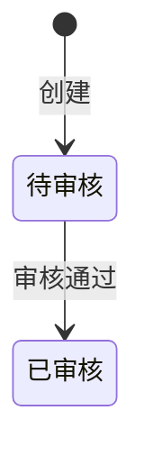
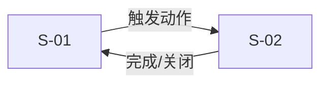

# 原型设计方案：{需求名称}

## 1. 设计概述

### 意图声明

{一段话：评审者使用这个原型后，应该理解什么——PRD 文字无法传达、必须通过交互体验才能理解的部分。}

### 设计思路

{2-3 段话，回答：
1. 为什么选这些屏幕？哪些交互效果必须通过原型传达？
2. 评审者的体验路径是什么？按什么顺序操作才能理解完整变更？
3. Delta 如何表达？变更点如何突出，上下文如何弱化？}

### 全局设计决策

| 决策项 | 选择 | 理由 |
|--------|------|------|
| 页面架构 | {左导航+顶栏+内容区 / 纯内容区 / ...} | {为什么} |
| 详情展示 | {Sheet 侧边栏 / Dialog 弹窗 / 新页面} | {为什么} |
| 信息密度 | {高（紧凑）/ 中 / 低} | {为什么} |
| Delta 标记 | {⭐标记 + 灰色占位 / 高亮边框 / ...} | {为什么} |

---

## 2. 状态与视觉映射

### 状态机

{从 PRD Ch.5 提取，Mermaid stateDiagram。}



### 状态→视觉映射

| 状态 | Badge 变体 | 颜色 | 可用操作 |
|------|-----------|------|---------|
| 待审核 | outline | amber | 审核、取消 |
| 已审核 | default | green | 发货 |

^ 原则：待处理用暖色引导注意力，完成态/终态用灰色降低权重。

### 枚举字段映射

| 字段 | 枚举值 | 显示文本 | 来源 |
|------|--------|---------|------|

---

## 3. 屏幕设计

### S-01: {屏幕名称}

**目的**：{回答评审者什么问题？}
**来源**：F-{XXX}, C-{XX}
**类型**：{list-view | form | dashboard | detail-panel | flow-viz}

#### 组件结构

{层级化描述。⭐ 标记变更点，[灰色] 标记不可交互的上下文。注明 shadcn/ui 组件名。}

```
Page
├── Breadcrumb（首页 > XX > XX）
├── FilterBar
│   ├── Select（状态）⭐ 新增选项
│   ├── Input（搜索）[灰色]
│   └── Button（查询/重置）
├── ActionBar
│   ├── Button（批量操作）⭐ 新增
│   └── Badge（已选 {n} 项）
├── DataTable
│   ├── Checkbox 列
│   ├── 字段列... [标准]
│   ├── 新增列 ⭐
│   └── 操作列（DropdownMenu）
└── Sheet / Dialog（详情，按需展开）
```

#### 数据契约

| 字段 | 类型 | 组件 | 样本值 | 来源 |
|------|------|------|--------|------|

#### 交互设计

{按评审者体验路径排列。每个交互写完整的 触发→过程→反馈→结果 链。}

**交互 1：{名称}** {⭐ 如果是变更点}
- **触发**：{用户做什么}
- **过程**：{中间发生什么（Dialog 确认？加载？）}
- **反馈**：{系统给什么提示（Toast？Badge 变色？）}
- **结果**：{最终状态变化}
- **PRD 引用**：F-XXX 步骤 N / 规则 N

#### 空状态与边界

| 场景 | 表现 |
|------|------|
| {无数据 / 无选择 / 校验失败 / ...} | {UI 表现} |

#### 本屏幕不做的部分

- {功能/区域}：{处理方式，如"标灰""Toast 提示不在范围"等}

---

{多屏幕重复 S-0X 结构}

---

## 4. 屏幕导航与体验路径



**推荐体验路径**：
1. {第一步：看到什么}
2. {第二步：做什么操作}
3. {第三步：观察什么结果}
4. ...

---

## 5. 模拟数据

{完整数据集，JSON 格式。覆盖 §2 所有状态，中文数据。}

```json
[]
```

^ 状态分布建议：{各状态占比}

---

## 6. 设计决策记录

| # | 决策 | 选择 | 备选 | 理由 |
|---|------|------|------|------|

---

## 迭代记录

| 轮次 | 日期 | 变更内容 |
|------|------|---------|
| R1 | {date} | 初稿 |
